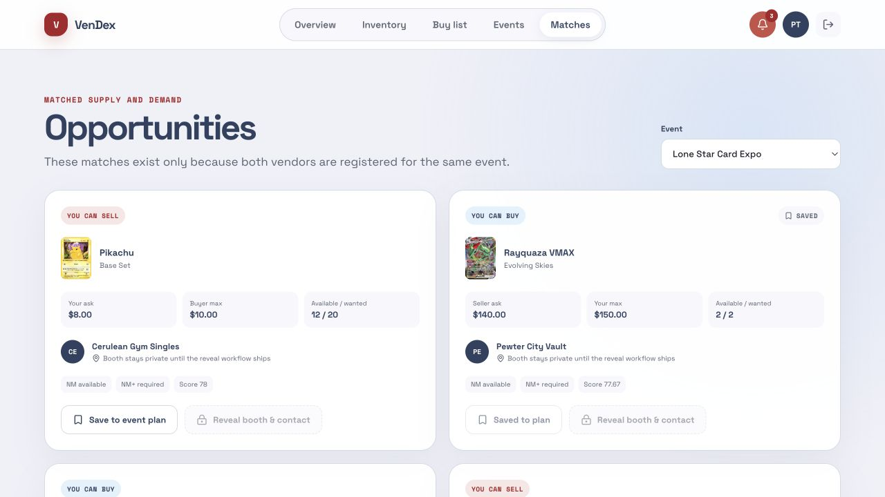
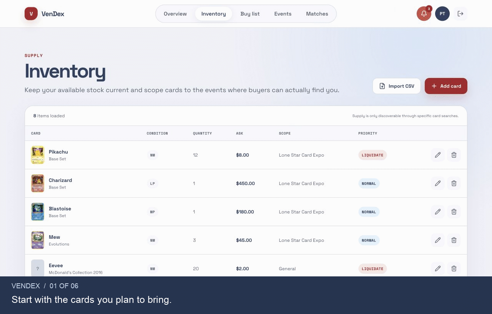
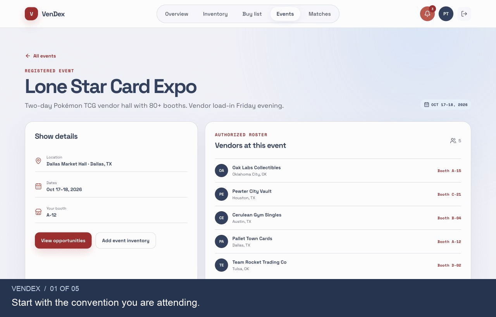
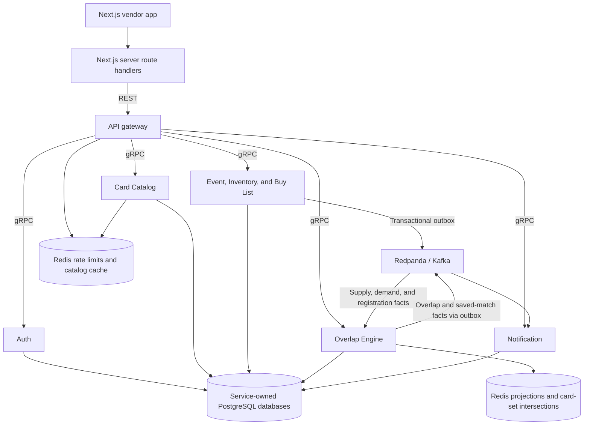

# VenDex

**Know who to buy from and sell to before the card show starts.**

VenDex helps Pokémon card sellers prepare for conventions. Add the cards you’re bringing and the cards you want to buy, then join your next event. VenDex finds sellers at that same event whose cards, prices, and condition fit what you need—and buyers who want your stock. Save the useful matches so you can spend less time searching the convention floor.



For example, Pallet Town Cards wants two Rayquaza VMAX cards for up to $150 each. Pewter City Vault is bringing two at $140 each, in the right condition. Both are attending the Dallas show, so VenDex surfaces the match.

## See it in action

These two captioned walkthroughs total about a minute. They use actual app screens and fictional vendors against the local backend. Prices are demo inputs, not market valuations.

### 1. Prepare your stock and buy list · 32 seconds

Import a spreadsheet, resolve an ambiguous card match, review the rows, and commit your inventory. Your buy list records the cards you want, the minimum condition you’ll accept, and your maximum price.



[View the import preview](docs/demo/assets/import-preview.png) · [View the buy list](docs/demo/assets/buy-list.png) · [Try the sample CSV](docs/demo/inventory.csv)

### 2. Find matches at your event and save them · 30 seconds

Compare buying and selling opportunities in Dallas, switch to Portland to see a different set of matches, then return to Dallas and save an opportunity. The dashboard tracks saved matches alongside your event preparation.



[View opportunities](docs/demo/assets/opportunities.png) · [View the dashboard](docs/demo/assets/dashboard.png) · [Demo script and walkthrough findings](docs/demo/README.md)

## What works today

The vendor app includes accounts and profiles, catalog search, inventory editing and reviewed CSV import, buy lists, event registration and rosters, automatic matching, saved opportunities, and in-app notifications.

This is a local vendor prototype. Saving currently adds a badge to the match and updates the dashboard count; a dedicated saved-plan screen is still missing. The contact-reveal action is disabled, and booth visibility needs reconciliation: the event roster already shows booths while match cards say they stay private. Email delivery, attendee offers, organizer tools, and production deployment are future work. There is no checkout or payment flow.

## System design

The backend is a Java 21 / Spring Boot system with seven domain services. The Next.js app sends requests through server-side route handlers to a REST gateway, which calls those services over gRPC. Each domain owns its PostgreSQL database; local Compose hosts the seven databases in one PostgreSQL container.



An inventory change writes the stock row and an outbox event in the same database transaction. The outbox relay publishes the event to Redpanda. The overlap engine combines inventory, buy-list, and event-registration facts in Redis, checks price and condition compatibility, and stores ranked matches in PostgreSQL. The UI reads those precomputed matches; notification updates follow through the same event pipeline. Updates are asynchronous, so a new match may take a moment to appear after a write or page refresh.

The gateway validates identity, ownership, and event access. The frontend keeps session tokens in server-managed `HttpOnly` cookies. Redis also supports gateway rate limiting and catalog caching.

This project doubles as a distributed-systems learning exercise. The [architecture walkthroughs](docs/learning/) explain the implementation and its tradeoffs, including [matching and replay](docs/learning/phase3-overlap-engine.md), [gateway workflows](docs/learning/phase4-api-gateway-workflows.md), and [catalog synchronization](docs/learning/card-catalog-scheduled-sync.md). The [product](product-spec.md) and [technical](technical-spec.md) specs include future plans; the code defines what is implemented.

## Run locally

You’ll need **Docker with Compose** and **Node.js 24 / npm**. Docker Desktop is the simplest fit for the demo seeder’s default networking. Java 21 and Maven are only needed on the host if you want to build or test the backend outside Docker.

From the repository root, start the backend:

```bash
docker compose up -d --build
docker compose ps
curl --fail http://localhost:8081/actuator/health
```

Containers starting does not mean every API is ready yet. Wait for the gateway health request to succeed. The catalog sync starts after an initial one-minute delay and downloads card data from TCGdex; the first run must finish before seeding the vendors. Follow its progress and look for `catalog sync: completed ... card upserts`:

```bash
docker compose logs -f card-catalog
```

In another terminal, configure and start the frontend:

```bash
cd frontend
cp .env.example .env.local
npm ci
npm run dev
```

If you already have `.env.local`, keep it and check that `GATEWAY_BASE_URL=http://localhost:8081`. Open [VenDex at localhost:3000](http://localhost:3000).

### Load the demo

From the repository root, with the gateway and catalog ready:

```bash
node scripts/seed/seed-dev.mjs
```

The seed creates two conventions and five fictional vendors with inventory and buy lists that produce both buying and selling opportunities. It writes through the gateway and Event gRPC API so the real matching pipeline sees the changes. Event creation currently uses a `grpcurl` Docker container because there is no organizer UI.

Sign in with **`ash.ketchum@vendex.local`** and password **`VendexDemo1!`**. This is the Pallet Town Cards account shown above. See [demo notes](docs/demo/README.md) for the other accounts and a repeatable walkthrough.

The seeder reuses vendors and events. If a vendor already has any inventory, it skips that vendor’s inventory **and** buy list; it does not repair a partially seeded account. CSV imports add rows, so repeating an import adds more stock. The fixture events are dated October/November 2026 and will eventually need refreshing.

### Useful local addresses

| Component | Address |
| --- | --- |
| Vendor app | [localhost:3000](http://localhost:3000) |
| REST gateway health | [localhost:8081/actuator/health](http://localhost:8081/actuator/health) |
| Redpanda topic console | [localhost:8080](http://localhost:8080) |

Port **8080 is the broker console**, not the API gateway. Stop the backend with `docker compose down`; its PostgreSQL volume is retained. Compose uses development credentials and plaintext internal connections and is not a production deployment configuration.

## Validation

```bash
# Backend: Java 21, Maven, and a running Docker daemon for Testcontainers
mvn --batch-mode --no-transfer-progress verify

# Frontend
cd frontend
npm run lint
npm test
npm run build
```

The [September 2026 walkthrough](docs/demo/README.md#walkthrough-findings) records what was exercised in the browser, the two fixes made while preparing this README, and the remaining gaps. The older [project handoff](docs/learning/project-handoff-2026-08-18.md) provides implementation history and the broader roadmap.
