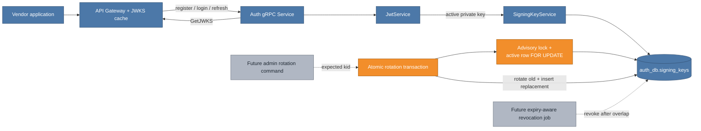

# Atomic signing-key rotation: changing the signer without an outage

VenDex signs access tokens with an RSA private key owned by Auth and publishes the
matching public keys through JWKS. PostgreSQL already enforced at most one active
row, but a uniqueness rule alone did not make rotation atomic: marking the old key
rotated and then failing to insert its replacement could leave no active signer.

This increment turns bootstrap and rotation into explicit database transactions.
It also gives a rotation request optimistic meaning: “replace this `kid` if it is
still current.” Two operators or replicas that observed the same current key
therefore converge on one replacement.

## Cumulative system view

**Legend:** blue is already on `main`; orange is added or materially changed by
this increment; gray is explicitly future.



Token issuance and verification stay on the existing blue path. Orange changes the
rare key lifecycle operation beneath that path; it adds no new public endpoint or
trust boundary.

## One transaction, two kinds of lock

```mermaid
sequenceDiagram
    participant A as Rotation caller A
    participant B as Rotation caller B
    participant S as SigningKeyService
    participant P as PostgreSQL

    A->>S: rotate(expected kid A)
    B->>S: rotate(expected kid A)
    S->>P: BEGIN; advisory transaction lock
    S->>P: SELECT active key FOR UPDATE
    P-->>S: kid A
    S->>S: generate and encrypt kid B
    S->>P: mark A rotated; insert B
    S->>P: COMMIT
    S-->>A: ROTATED, active kid B

    S->>P: acquire lock after caller A commits
    S->>P: SELECT active key FOR UPDATE
    P-->>S: kid B
    S->>S: expected A no longer matches
    S->>P: COMMIT without generating a key
    S-->>B: UNCHANGED, active kid B
```

`SELECT ... FOR UPDATE` serializes changes when an active row exists. It cannot lock
a row in an empty table, so startup additionally takes a transaction-scoped Postgres
advisory lock before checking for an active key. That closes the concurrent-bootstrap
gap without adding a second coordination table. The existing partial unique index
remains a final database invariant.

RSA generation and AES-GCM encryption happen after ownership is established but
before the old row changes. The old key update and replacement insert then share the
same transaction. Any encryption, SQL, constraint, process, or connection failure
rolls the transaction back, leaving the old signer active.

## Key states and JWKS continuity

| State | Signs new tokens | Published in JWKS | Meaning |
|---|---:|---:|---|
| Active (`rotated_at` and `revoked_at` null) | Yes | Yes | The single current signer |
| Rotated (`rotated_at` set, `revoked_at` null) | No | Yes | Verifies tokens issued before rotation |
| Revoked (`revoked_at` set) | No | No | Safe to remove after the validity overlap |

Rotation does not revoke the previous public key. Existing access tokens continue to
verify while new tokens use the replacement `kid`; revocation remains a separate,
expiry-aware operation.

## Major entities introduced or modified

| Entity | Kind | Change | Responsibility |
|---|---|---|---|
| `SigningKeyService.rotateSigningKey` | domain service operation | Added | Replaces an expected active `kid` atomically and reports rotated vs unchanged |
| `SigningKeyService.ensureActiveKey` | startup lifecycle | Modified | Bootstraps exactly one signer through the same transaction lock |
| `SigningKeyRepository.acquireRotationLock` | persistence coordination | Added | Serializes bootstrap/rotation even when no active row exists |
| `SigningKeyRepository.findActiveForUpdate` | repository query | Added | Locks the active signer for the transaction |
| `SigningKeyRepository.markRotated` | repository mutation | Modified | Requires exactly one active row to change |
| `SigningKeyServiceIT` | integration test | Added | Proves one concurrent winner and rollback after replacement rejection |

## Deliberate follow-ups

- No admin-facing rotation endpoint or CLI is exposed in this increment. When added,
  it should supply the operator-observed `kid` and report `UNCHANGED` as a safe
  concurrent outcome.
- Automatic revocation needs an explicit maximum token-validity policy and audit
  trail before it removes a rotated public key from JWKS.
- In-process public-key caching is tracked separately; it changes validation
  performance and revocation staleness, not rotation atomicity.
