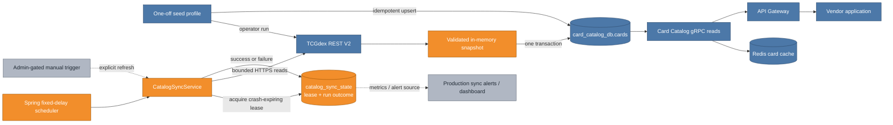
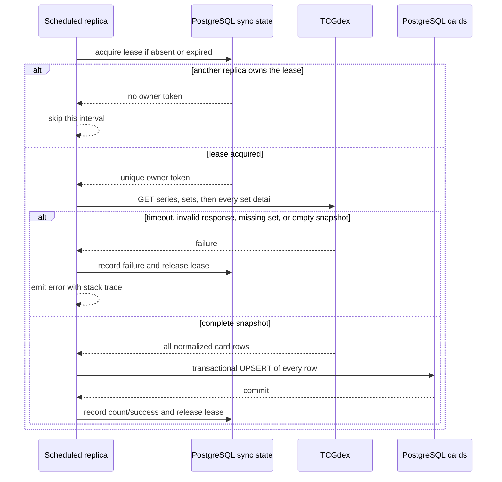

# Card Catalog scheduled sync: keeping a local source of truth current

The Phase 1 Card Catalog copied TCGdex into PostgreSQL through an explicit seed
profile. That removed an external dependency from every product request, but it also
made new sets an operator task. This increment keeps the same local-first read path
and makes refresh automatic, transactional, observable, and safe across replicas.

TCGdex's current API is REST V2, read-only, and served over HTTPS. Its set-list
response represents `cardCount` as an object rather than a number, so the local DTO
now follows that contract before automated production traffic begins. See the
[REST overview](https://tcgdex.dev/rest), [sets endpoint](https://tcgdex.dev/rest/sets),
and [Set schema](https://tcgdex.dev/reference/set).

## Cumulative system view

**Legend:** blue is already on `main`; orange is added or materially changed by
this increment; gray is explicitly future.

The orange flow is entirely outside the user request path. Search, detail, batch
hydration, and set-list reads still use the existing blue PostgreSQL/Redis path.
Refresh therefore improves freshness without turning TCGdex availability into
product availability.

## Refresh and failure flow

The service deliberately downloads and validates the complete snapshot before
writing. A missing set response, blank required ID/name, timeout, database failure,
or empty snapshot aborts the run. `CardRepository.upsertAll` is transactional, so a
bad row rolls back every write from that refresh. The failure is then stored in
`catalog_sync_state` and logged at error level; the next interval can retry safely.

The lease is stored in the same service-owned database rather than memory. Only the
replica holding the random owner token may complete or fail a run. If that replica
crashes, the lease expires after the configured duration and another replica can
continue. The duration is intentionally longer than the HTTP-bounded refresh; it is
not a renewable distributed lock.

## Idempotence and cache behavior

Cards retain their canonical UUID because the upsert conflicts on TCGdex
`external_id` and updates mutable metadata in place. New cards are inserted; known
cards are refreshed. Cards removed upstream are not deleted automatically because
other services may already reference their canonical UUIDs.

Redis remains cache-aside with a one-hour default TTL. A refreshed card may therefore
serve its previous cached metadata until that bounded TTL expires; no downstream ID
or transactional guarantee depends on immediate cache invalidation.

## Major entities introduced or modified

| Entity | Kind | Change | Responsibility |
|---|---|---|---|
| `CatalogSyncService` | service | Added | Schedules refreshes, owns the lease workflow, validates non-empty snapshots, and records outcomes |
| `catalog_sync_state` | PostgreSQL table | Added | Coordinates replicas and preserves last-run operational evidence |
| `CatalogSyncStateRepository` | repository | Added | Atomically acquires owner-token leases and guards completion/failure transitions |
| `CardRepository.upsertAll` | repository operation | Modified | Commits a complete snapshot atomically or rolls it all back |
| `TcgDexClient` | external adapter | Modified | Uses bounded requests, current `cardCount` shape, and strict all-set failure semantics |
| `CardCatalogProperties.Sync` | configuration | Added | Controls enablement, initial delay, fixed delay, and lease duration |
| `SeedRunner` / `seed` profile | operator workflow | Modified | Remains available for explicit one-off runs while disabling the scheduler |

## Deliberate follow-ups

- An authenticated, admin-only manual trigger is not exposed yet. Scheduled refresh
  solves freshness without adding a new public trust boundary.
- The state table and error logs provide evidence, but production metrics, alerting,
  and a sync-status dashboard belong with the deployment/observability increment.
- Upstream deletions require an explicit retention policy because hard deletion can
  break canonical references in inventory, buy lists, overlaps, and notifications.
