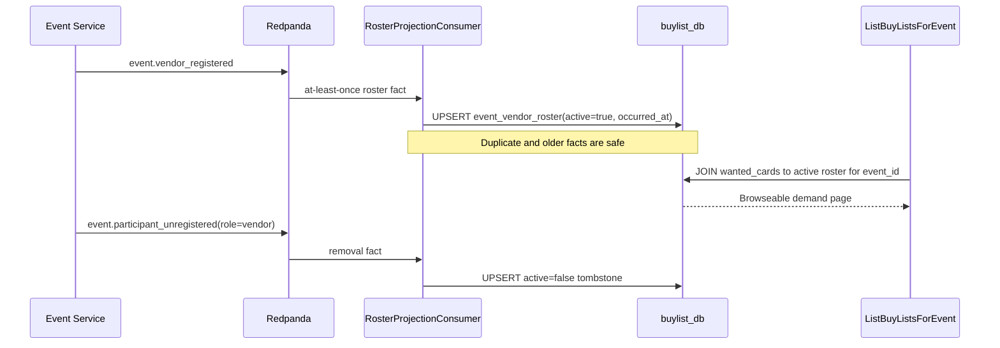
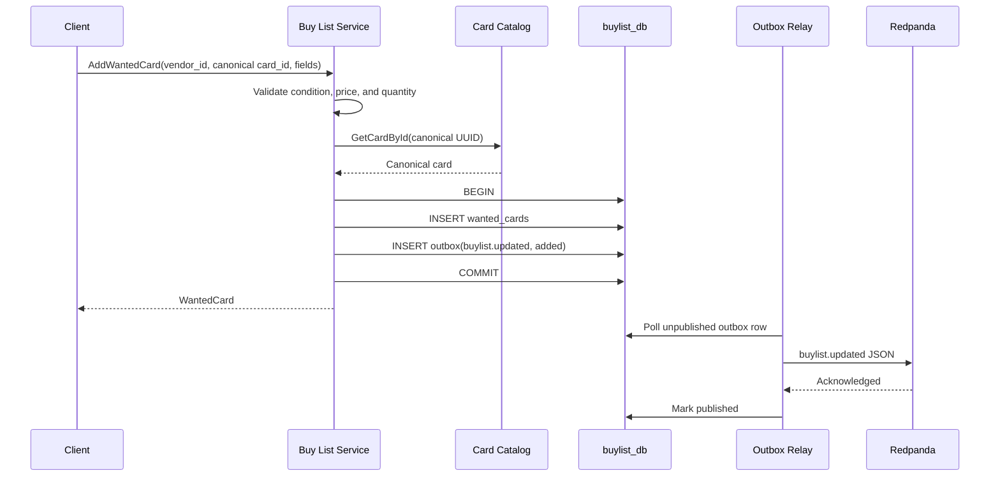

# Phase 2 Buy List Service: browseable demand without synchronous roster coupling

The Buy List Service completes VenDex's Phase 2 domain foundation. Inventory describes supply; Buy List describes persistent vendor demand. A vendor records each canonical card once, then changes minimum condition, maximum buy price, or desired quantity as their buying posture changes. Every mutation becomes a durable `buylist.updated` fact for the future overlap engine.

The harder design question was event browsing. Buy lists are intentionally global, but `ListBuyListsForEvent` must show demand only from vendors attending one event. Calling Event Service during every browse would make availability and latency depend on another service. Storing `event_id` on every wanted card would incorrectly duplicate persistent demand. This increment instead consumes roster facts into a small local projection.

## Cumulative system view

**Legend:** blue is already on `main`; orange is added by this increment; gray is planned but not built yet.

```mermaid
flowchart LR
    Gateway[Future API Gateway]
    Auth[Auth Service]
    Catalog[Card Catalog Service]
    Redis[(Redis)]
    Event[Event Service]
    EventDb[(event_db)]
    Inventory[Inventory Service]
    InventoryDb[(inventory_db)]
    Broker[Redpanda]
    Contracts[Shared event contracts]
    OutboxLib[Shared outbox library]

    BuyList[Buy List Service]
    BuyListDb[(buylist_db)]
    Wanted[(wanted_cards)]
    RosterConsumer[Roster projection consumer]
    Roster[(event_vendor_roster)]
    BuyListOutbox[(outbox)]

    Overlap[Overlap Detection]
    Notifications[Notification Service]

    Gateway -. future requests .-> BuyList
    BuyList -->|canonical UUID lookup| Catalog
    BuyList -->|same transaction| Wanted
    BuyList -->|same transaction| BuyListOutbox
    Wanted --> BuyListDb
    BuyListOutbox --> BuyListDb
    BuyList -. uses .-> Contracts
    BuyList -. uses .-> OutboxLib
    OutboxLib -->|buylist.updated| Broker

    Event --> EventDb
    Event -->|vendor registered / participant unregistered| Broker
    Broker --> RosterConsumer
    RosterConsumer --> Roster
    Roster --> BuyListDb
    BuyList -->|local join for event browse| Roster

    Inventory --> InventoryDb
    Inventory -->|inventory.updated| Broker
    Catalog --> Redis
    Broker -. future supply + demand + roster .-> Overlap
    Overlap -. future overlap.found .-> Notifications

    classDef current fill:#4C78A8,stroke:#2F4B6C,color:#fff;
    classDef added fill:#F28E2B,stroke:#9A5200,color:#fff;
    classDef future fill:#B0B7C3,stroke:#68717D,color:#1F2933;
    class Auth,Catalog,Redis,Event,EventDb,Inventory,InventoryDb,Broker,Contracts,OutboxLib current;
    class BuyList,BuyListDb,Wanted,RosterConsumer,Roster,BuyListOutbox added;
    class Gateway,Overlap,Notifications future;
```

Blue now includes the complete supply path and event source from the earlier Phase 2 increments. Orange adds demand plus the project's first production Kafka consumer. Gray is Phase 3, which finally combines these facts into actionable overlaps.

## Major entities introduced or modified

| Entity | Kind | Responsibility |
|---|---|---|
| `BuyListService` | Spring domain service | Validates canonical cards, money, condition, quantity, ownership, filters, and pagination. |
| `BuyListWriter` | Transactional boundary | Commits wanted-card mutations and matching outbox facts as one unit. |
| `BuyListRepository` | JDBC repository | Owns CRUD, browseable event-demand SQL, and timestamp-aware roster projection writes. |
| `wanted_cards` | PostgreSQL table | Stores one persistent demand row per vendor and canonical card. |
| `event_vendor_roster` | PostgreSQL projection | Stores active membership plus inactive tombstones so older events cannot resurrect departed vendors. |
| `RosterProjectionConsumer` | Kafka consumer | Applies vendor registration and vendor unregistration facts without a synchronous Event Service call. |
| `buylist.proto` | Protobuf API | Defines manual CRUD, vendor-list pagination, and browseable event-demand filters. |
| `GrpcCardCatalogGateway` | Service boundary | Validates the canonical Card Catalog UUID with a deadline and stable error mapping. |
| `BuyListApplicationIT` | Integration test | Proves roster consumption, local event browsing, and `buylist.updated` outbox publication against real Postgres and Redpanda. |

## Persistent demand versus event membership

A buy list answers “what is this vendor willing to buy?” rather than “what are they willing to buy only at this convention?” The same list should become relevant at every event the vendor attends. That is why `BuyListUpdated` deliberately has no `event_id`: Phase 3 will apply the vendor's demand to every active event membership it knows.

The event browse still needs an event boundary. Its SQL joins `wanted_cards` to active rows in `event_vendor_roster`. The projection is disposable derived state: Event Service remains the source of truth, Kafka is the transfer mechanism, and a fresh consumer group can rebuild it from retained facts.

## Roster projection flow



The consumer and database commit share the listener transaction boundary. Kafka acknowledges only after the method succeeds. A crash after the database commit but before the offset commit causes redelivery; the upsert is idempotent.

## Handling duplicates and out-of-order facts

At-least-once delivery means duplicate events are normal. Cross-topic facts can also arrive later than expected. Each roster row stores the fact's `occurred_at`:

- a newer fact replaces the existing state;
- an older fact is ignored;
- the same fact can be applied repeatedly;
- at an equal timestamp, unregistration wins, so a delayed registration cannot resurrect a vendor.

Inactive rows remain as tombstones. Deleting them would lose the timestamp needed to reject an older registration later.

## Wanted-card mutation flow



The unique `(vendor_id, card_id)` constraint prevents ambiguous duplicate demand. Clients use `UpdateWantedCard` when their buying terms change. As with Inventory, the Card Catalog network check happens before the database transaction, while the business write and publication intent commit together.

## Browse demand, query supply

`ListBuyListsForEvent` is browseable: an event ID alone returns a page of active vendors' wanted cards, ordered by maximum buy price. Optional canonical-card, minimum-condition, and minimum max-buy-price filters narrow the page. This helps vendors discover what they could sell while walking into a convention.

Inventory remains query-only: `SearchInventoryForEvent` requires a specific card. The asymmetry is product behavior, not just UI styling. VenDex reveals demand broadly but does not publish every vendor's entire supply catalog.

## Verification strategy

Fast tests cover validation, ownership, pagination, browse filters, canonical gRPC lookup, duplicate handling, outbox actions, roster deserialization, and attendee-event exclusion. PostgreSQL tests verify the unique constraint, filtering join, active membership, out-of-order rejection, and equal-timestamp removal precedence. The application integration test publishes a real registration fact to Redpanda, waits for the PostgreSQL projection, adds demand through the gRPC adapter, browses it by event, consumes `buylist.updated`, then publishes unregistration and proves the demand disappears from that event without being deleted globally.

## What remains after this increment

Phase 2's three domain services are complete: Event supplies context and roster, Inventory supplies stock, and Buy List supplies demand. Phase 3 can now consume their facts into event-scoped Redis sets, compute price/condition/quantity-aware overlaps, persist actionable opportunities, and notify vendors. The future API Gateway still owns JWT-derived identity, authorization, and display-name/booth decoration.
