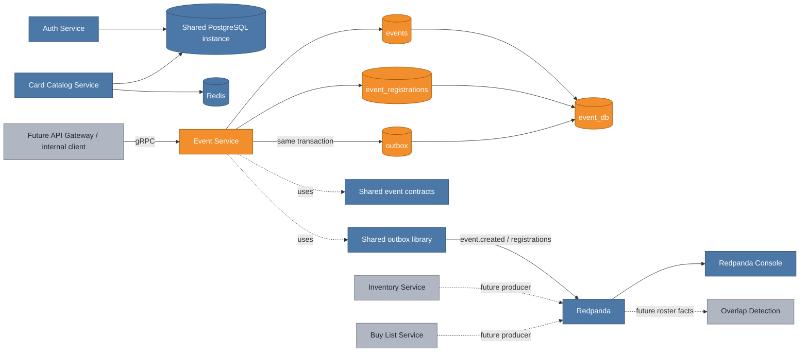
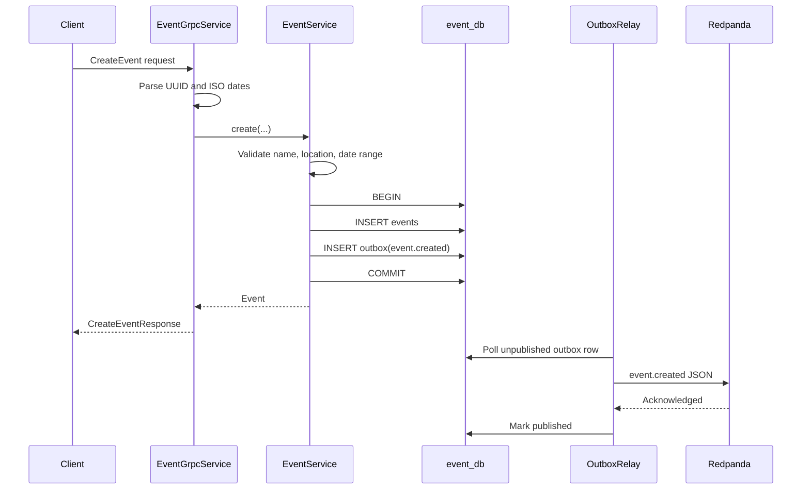

# Phase 2 Event Service: giving every match a convention context

The Event Service is VenDex's first Phase 2 domain service and its first real producer of durable Kafka events. It owns convention metadata and the roster that says which vendors and attendees belong to an event. That roster is the boundary that later prevents inventory matching from becoming a global, context-free marketplace.

## Cumulative system view

**Legend:** blue is already on `main`; orange is added by this increment; gray is planned but not built yet.

## Major entities introduced

| Entity | Kind | Responsibility |
|---|---|---|
| `EventService` | Spring domain service | Validates event and registration rules and keeps business writes atomic with outbox writes. |
| `EventGrpcService` | gRPC adapter | Parses protobuf requests, calls domain logic, and maps results/errors back to protobuf and gRPC status codes. |
| `EventRepository` | JDBC repository | Owns all SQL for events and registrations. |
| `events` | PostgreSQL table | Stores convention identity, organizer, location, dates, venue, and description. |
| `event_registrations` | PostgreSQL table | Stores the vendor/attendee roster and per-event vendor booth. |
| `events.proto` | Protobuf API | Defines create/update/get/list and register/unregister operations. |
| `EventUpdated` | Kafka contract | Keeps downstream event metadata projections current after organizer edits. |
| `EventAttendeeRegistered` | Kafka contract | Completes the registration event family alongside `EventVendorRegistered`. |
| `EventParticipantUnregistered` | Kafka contract | Lets future consumers remove stale roster and overlap projections. |
| `OutboxAutoConfiguration` | Shared infrastructure | Now supplies a Java-time-aware JSON mapper to non-web producer services. |
| `EventApplicationIT` | Integration test | Proves a business write and outbox record reach a real Redpanda broker. |

## Create-event flow

The client receives a successful response only after PostgreSQL has committed both the event and the durable intent to publish it. It does not wait for Redpanda. A broker outage delays downstream delivery without losing the event or making the user retry an already-committed create operation.

## Registration rules

- A user may register only once per event, enforced by a database unique constraint rather than a race-prone read-before-write check.
- Vendors may store a booth such as `B-7`; attendees may not claim booth space.
- `event.vendor_registered` is keyed by vendor ID so later vendor-centric matching work stays ordered.
- `event.attendee_registered` is keyed by attendee ID and becomes useful when the Phase 5 anonymous-listing flow arrives.
- `event.participant_unregistered` removes stale downstream roster projections and overlaps when somebody leaves.
- Unregister is idempotent. Repeating it succeeds without publishing a second removal if the registration is already absent, which makes client retries safe.

## Service boundary and deferred authorization

The Event Service verifies business ownership on updates by requiring the original organizer ID, but it cannot yet prove that the caller actually owns that identity. Phase 4's API Gateway will validate JWTs and supply trusted caller context. Until then, Phase 2 gRPC services are internal and trust caller-supplied IDs, as documented in the technical spec.

## Verification strategy

Unit tests isolate rules and emitted contract types with a fixed clock. The integration test then boots Spring against real Postgres and Redpanda containers, creates an event and vendor registration, consumes both Kafka records, and verifies no unpublished outbox rows remain. That division keeps rule tests fast while still proving the distributed boundary once.

## What remains after this increment

Inventory and Buy List services are still gray. Once they publish their own updates, Phase 3 can combine roster, supply, and demand facts into event-scoped overlaps. The future API Gateway will also replace caller-supplied identity with authenticated context and decorate vendor IDs with shop names and booths.
