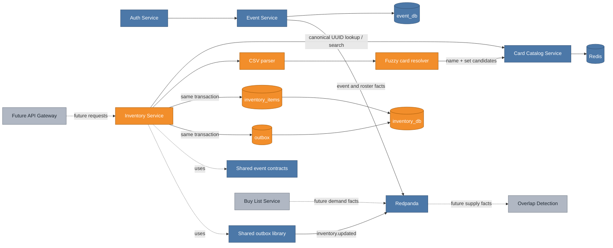
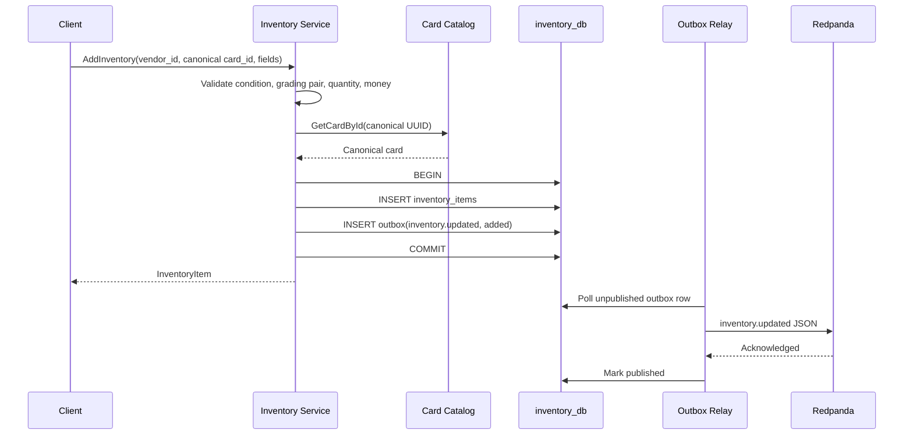

# Phase 2 Inventory Service: turning vendor stock into durable supply facts

The Inventory Service gives VenDex its supply side. A vendor can add a canonical card manually or import a CSV, scope it to one convention or make it always available, and update or remove it later. Each successful mutation persists the vendor-owned item and a durable `inventory.updated` fact together. Phase 3 can therefore react to supply changes without asking Inventory to participate in a distributed transaction.

## Cumulative system view

**Legend:** blue is already on `main`; orange is added by this increment; gray is planned but not built yet.



The orange path is intentionally narrow: Inventory asks Card Catalog for card identity, owns the mutable stock record, and publishes facts. It does not copy card metadata, event registration, vendor profile, or booth data into its database.

## Major entities introduced or changed

| Entity | Kind | Responsibility |
|---|---|---|
| `InventoryService` | Spring domain service | Validates ownership and inventory rules, coordinates canonical-card checks, pages reads, and resolves every CSV row before persistence begins. |
| `InventoryWriter` | Transactional boundary | Commits item mutations and matching outbox rows atomically; a scope move emits removal from the old event and addition to the new scope. |
| `InventoryRepository` | JDBC repository | Owns inventory CRUD, vendor/event views, and the deliberately card-scoped event supply query. |
| `inventory_items` | PostgreSQL table | Stores vendor, canonical card, optional event, condition/grading, quantity, price, priority, and timestamps. |
| `inventory.proto` | Protobuf API | Defines manual CRUD, event-scoped reads, query-only supply search, and CSV preview/commit responses. |
| `CsvInventoryParser` | Ingestion boundary | Parses RFC-style quoted CSV, validates required/optional columns, and reports row-level problems without aborting the preview. |
| `FuzzyCardResolver` | Matching policy | Scores Card Catalog candidates by normalized name and set similarity, auto-resolving only when confidence and separation thresholds are met. |
| `GrpcCardCatalogGateway` | Service boundary | Validates canonical UUIDs and searches candidates with deadlines and domain-specific error mapping. |
| `CardService` / `CardRepository` | Existing boundary corrected | `GetCardById` and batch lookup now honor the proto's canonical internal UUID while retaining external-ID compatibility. |
| `InventoryApplicationIT` | Integration test | Proves `AddInventory -> inventory_items + outbox -> Redpanda` against real containers. |

## Why the canonical-ID correction matters

The Card Catalog proto has always labeled `Card.id` as the internal UUID, and Inventory stores that UUID as its logical cross-service reference. Before this increment, `GetCardById` interpreted every input as a TCGdex external ID such as `sv03-001`. A caller could receive a UUID from Search and then fail to retrieve the same card by that advertised identity.

Inventory exposed that boundary mismatch. Card Catalog now first recognizes a UUID and reads the primary key; non-UUID input follows the existing external-ID cache path for compatibility. Batch lookup accepts a mixture and preserves request order. This keeps the new service on one stable identity without breaking older learning examples or seed-oriented tools.

## Manual-entry flow



The catalog network call happens before the database transaction. A slow or unavailable dependency therefore cannot hold an inventory transaction open. Once the write begins, the item and publication intent succeed or fail as one unit.

## CSV preview and commit flow

```mermaid
sequenceDiagram
    participant V as Vendor
    participant I as Inventory Service
    participant P as CSV Parser
    participant CC as Card Catalog
    participant DB as inventory_db

    V->>I: BulkImportCSV(dry_run=true)
    I->>P: Parse bounded CSV
    P-->>I: Valid rows + row-level issues
    loop each valid row
        I->>CC: SearchCards(card_name)
        CC-->>I: Ranked candidate cards
        I->>I: Score name + set; apply threshold and ambiguity gap
    end
    I-->>V: Resolved preview + issues + candidate suggestions
    V->>I: BulkImportCSV(dry_run=false)
    Note over I,CC: Resolve all rows before the first JDBC write
    I->>DB: BEGIN
    I->>DB: INSERT all resolved items + outbox facts
    I->>DB: COMMIT
    I-->>V: Imported items + remaining issues
```

This API matches the future four-step UI: file selection, resolution feedback, preview, and commit. Ambiguous rows remain visible with up to three candidates rather than being silently attached to the wrong printing. The current API commits the automatically resolved subset; a later gateway/UI increment can add explicit user-selected resolutions without weakening the backend thresholds.

## Event scope and visibility

An `event_id` on an item means that stock is offered at one convention. A null `event_id` means always available. Vendor event views and buyer searches include both the requested event and always-available stock, but never stock scoped to another event.

Supply is query-only: `SearchInventoryForEvent` requires a canonical `card_id` and offers condition and maximum-price filters. There is no endpoint that browses every vendor's inventory at a convention. That preserves VenDex's "browse demand, query supply" product boundary; attendees can locate a card they already want without turning the convention into an online catalog.

## Verification strategy

Fast tests cover parser limits and quoting, fuzzy confidence/ambiguity behavior, validation and ownership, transactional event selection, pagination, and the actual in-process gRPC client boundary. PostgreSQL tests exercise database constraints and event visibility SQL. The application integration test runs Spring with real PostgreSQL and Redpanda containers, calls the gRPC adapter, consumes `inventory.updated`, and checks that no unpublished outbox record remains.

## What remains after this increment

The Buy List Service is still gray. It will add browseable demand facts beside Inventory's query-only supply facts. Phase 3 can then consume inventory, buy-list, and roster events to maintain event-scoped overlaps. Phase 4's gateway will authenticate the caller, replace client-supplied vendor IDs with trusted JWT identity, decorate results with vendor/booth data, and connect the CSV contract to the existing `ui/vendex.pen` mockups.
