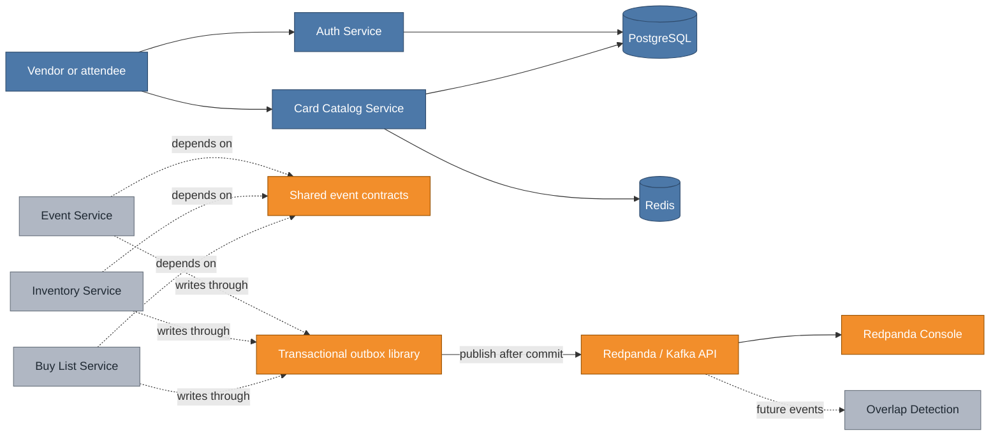
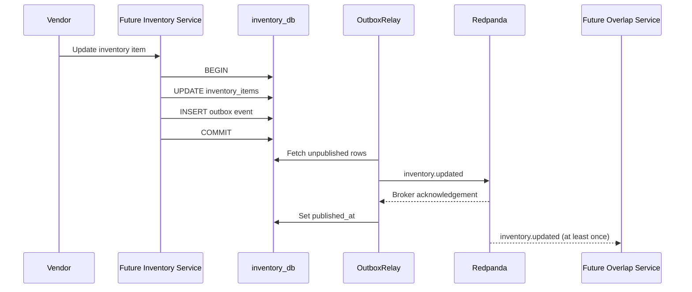

# Phase 2 plumbing: from synchronous services to durable domain events

PR #10 is the bridge between VenDex's Phase 1 request/response services and the event-driven services planned for Phases 2 and 3. It does not add a user-facing service. It adds the shared infrastructure that lets later services persist a business change and reliably announce that change to Kafka-compatible consumers.

## Cumulative system view

**Legend:** blue is the system already present on `main`; orange is added by this increment; gray is planned but not built yet.

The dashed connections show intended consumers of this plumbing. Those services are deliberately gray because their code is not part of PR #10.

## Major entities introduced

| Entity | Kind | Responsibility |
|---|---|---|
| `events` | Maven module | Gives producers and consumers one compiled definition of topic names and JSON payloads. |
| `InventoryUpdated`, `BuyListUpdated`, `EventCreated`, `EventVendorRegistered` | Event contracts | Define the initial Phase 2 facts placed on the broker. |
| `OutboxWriter` | Shared library class | Serializes a domain event and inserts it into the service's database transaction. |
| `OutboxRepository` | Shared library class | Persists, polls, and marks outbox records as published. |
| `OutboxRelay` | Scheduled worker | Publishes committed outbox records to Redpanda with at-least-once delivery. |
| `outbox` | PostgreSQL table | Stores pending event payloads durably beside each service's business data. |
| Redpanda | Kafka-compatible broker | Carries domain events from Phase 2 producers to Phase 3 consumers. |
| Redpanda Console | Development UI | Makes local topics and JSON payloads inspectable. |

## Concrete data flow

The future Inventory Service will use the shared plumbing like this:

1. A vendor changes an inventory item.
2. One database transaction updates `inventory_items` and calls `OutboxWriter`.
3. `OutboxWriter` inserts an `inventory.updated` JSON record into the same database's `outbox` table.
4. The transaction commits both records together. If it rolls back, neither record exists.
5. `OutboxRelay` polls the committed row, publishes it to Redpanda, waits for acknowledgement, and sets `published_at`.
6. A Phase 3 overlap consumer may receive the event more than once, so it must process events idempotently.

## Why the outbox exists

Publishing directly after a database commit creates a dual-write gap: the database can succeed while the broker call fails, leaving downstream matching permanently unaware of the change. Publishing before commit has the opposite problem: consumers can observe a change that later rolls back. The outbox makes the business record and the intent to publish atomic by storing both in one PostgreSQL transaction.

The tradeoff is operational complexity and at-least-once delivery. The polling relay adds latency, published rows need a future retention policy, and every consumer must tolerate duplicates. For VenDex, that cost is justified because overlap detection depends on not silently losing inventory or buy-list changes.

## What remains after this increment

The Event, Inventory, and Buy List services still need their own schemas, gRPC APIs, validation, and producer integration. The first producer PR should add a Testcontainers round-trip test proving `business write -> outbox -> Redpanda`. Phase 3 then adds idempotent consumers and the actual overlap engine.
