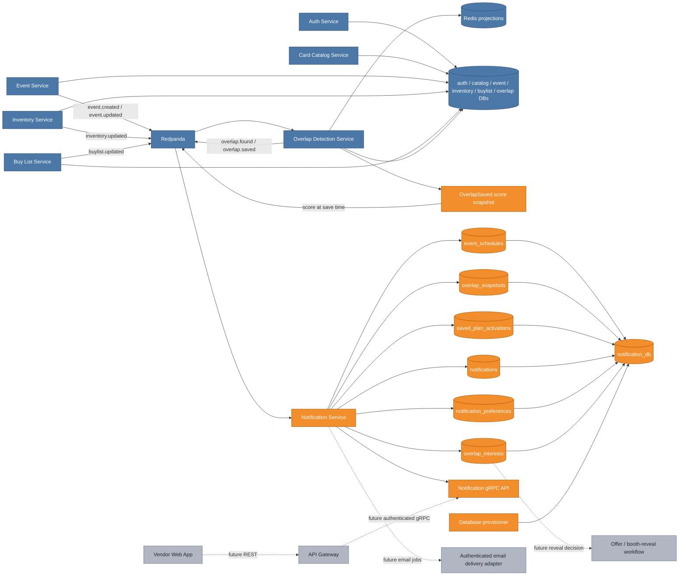
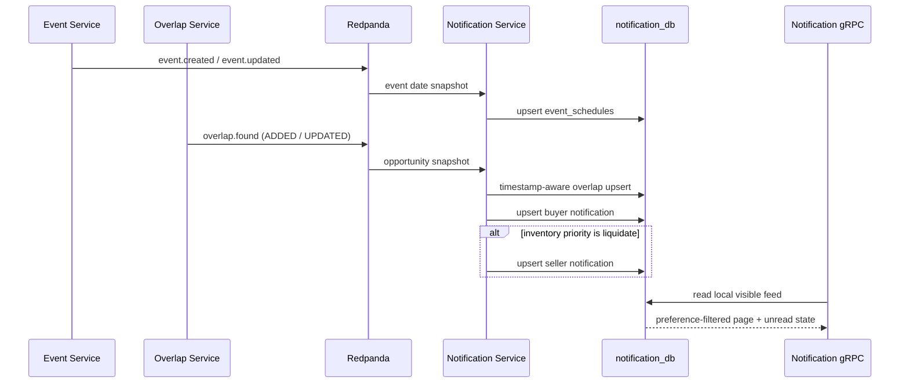

# Phase 3 Notification Service: turning overlap facts into durable, preference-aware activity

The Overlap service answers which vendors should meet, but an opportunity only has value if the right person sees it at the right time. This increment adds the durable delivery side of that loop. Notification Service consumes overlap and event facts, maintains its own replayable projections, builds one stable activity row per recipient/overlap/trigger, and exposes feeds, unread state, preferences, and seller-visible interest through gRPC.

No Notification read calls another service. Kafka provides the source facts, `notification_db` owns the delivery projection, and gRPC reads only that local state. That keeps feed latency bounded and lets Notification recover by replaying facts without coupling its availability to Event or Overlap.

## Cumulative system view

**Legend:** blue is already on `main`; orange is added or materially changed by this increment; gray is planned but not built yet.



The `OverlapSaved` score addition is orange even though Overlap is blue. Conversation interest needs the ranking exactly as it existed when the user saved the opportunity. Reconstructing it later from a mutable overlap would silently rewrite historical intent.

## Major entities introduced or modified

| Entity | Kind | Responsibility |
|---|---|---|
| `OverlapSaved.score` | Kafka contract | Carries the immutable overlap-score snapshot used to rank saved interest. |
| `NotificationEventConsumer` | Kafka consumer | Dispatches overlap, save, and event facts into transactional projection handlers. |
| `NotificationProjectionService` | Application service | Reconciles live notifications, T-0 saved activation, and interest lifecycle. |
| `NotificationDeliveryPolicy` | Domain policy | Converts real-time, daily, event-only, and saved-at-T-0 rules into `available_at`. |
| `NotificationRepository` | Persistence adapter | Applies timestamp-aware upserts, deduplication, preference filtering, unread state, and interest queries. |
| `event_schedules` | PostgreSQL projection | Keeps event dates locally so delivery never synchronously calls Event Service. |
| `overlap_snapshots` | PostgreSQL projection | Retains the newest active/tombstoned opportunity and its original JSON payload. |
| `saved_plan_activations` | PostgreSQL projection | Tracks each saved event-plan fact and whether its T-0 notification has activated. |
| `notifications` | PostgreSQL read model | Stores one durable notification per vendor, overlap, and trigger with read/active/availability state. |
| `notification_preferences` | PostgreSQL table | Stores channel toggles, trigger toggles, digest policy, and per-event mutes. |
| `overlap_interests` | PostgreSQL conversation state | Stores idempotent saved-interest snapshots, ranked by score for the overlap seller. |
| `notifications.proto` | gRPC API | Exposes feed paging, unread/read actions, preference patching, and seller interest reads. |
| `NotificationApplicationIT` | Integration test | Proves the real Redpanda → PostgreSQL → preferences → gRPC lifecycle. |

## Why Notification owns projections instead of making service calls

An `overlap.found` record already carries the participants, card, priority, score, and price/condition/quantity snapshot. Event facts carry the date range. Copying those into Notification's database provides three useful guarantees:

1. A feed read does not fail because Event or Overlap is restarting.
2. A Kafka replay can rebuild notification state deterministically.
3. Event-day activation can run locally without a fan-out of synchronous date lookups.

This is intentional data duplication, not shared ownership. Event still owns event truth and Overlap still owns opportunity/save truth. Notification owns only the delivery and conversation projections derived from their facts.



## Stable deduplication and unread behavior

The logical notification key is:

```text
(vendor_id, overlap_id, trigger_type)
```

An overlap update therefore changes the existing row rather than creating another alert. The rules are deliberately different for delivery state and source state:

- a byte-for-byte replay keeps the same ID and preserves `is_read`;
- changed overlap payload updates the same ID and resets it to unread;
- reactivation after a removal resets it to unread;
- removal marks every trigger for that overlap inactive without deleting history;
- a stale fact cannot overwrite a newer snapshot;
- removal wins an equal-timestamp tie.

The notification table records `source_occurred_at` separately from `updated_at`. The former decides whether a source fact may win; the latter records when this projection processed or rescheduled the row. Mixing those clocks would let a local preference change accidentally defeat a later replayed source event.

## Delivery timing is modeled as availability

Notification rows exist durably before every user can necessarily see them. `available_at` is the common scheduling mechanism:

| Mode or trigger | `available_at` rule |
|---|---|
| Real-time overlap | Source fact timestamp |
| Daily digest | Next configured digest time in the configured event zone |
| Event-only overlap | Start of the event date |
| Saved overlap active | Start of the event date, regardless of general digest mode |

The feed query returns only active rows whose `available_at` has arrived, then dynamically applies in-app enablement, trigger toggles, and event mutes. Dynamic filtering means muting an event immediately hides existing activity without destructive rewrites. Changing digest mode reschedules active rows from their original source timestamps.

Event currently publishes `LocalDate` without an IANA time zone. Notification therefore uses a configurable service-wide zone, defaulting to UTC. A later contract version should put the event's own zone on its facts before the app operates across several time zones.

## Saved plans and interest are separate concepts

`overlap.saved` has two downstream effects:

- `saved_plan_activations` remembers to re-surface that exact plan item when the event starts;
- `overlap_interests` records a ranked, non-locking signal for the counterparty.

The T-0 worker is idempotent. It may poll the same due plan repeatedly, but the stable notification key produces only one `saved_overlap_active` row and `activated_at` records the first successful activation. If a save arrives on or after the event date, it activates immediately. If the overlap is inactive, the plan remains durable but produces no live notification until a newer overlap fact reactivates it.

Interests are also retained rather than deleted. Removing an overlap changes pending interest to `expired`; reactivating a saved overlap restores it to `pending`. The seller-only gRPC read checks ownership and orders results by score. The later Offer workflow will own `revealed` and `declined` transitions plus booth/contact disclosure.

One product-model limitation remains explicit: an overlap ID includes a specific buyer, seller, and card. Multiple buyers interested in the seller's same physical inventory therefore occupy separate overlap IDs. A Phase 4 seller summary can aggregate those rows by event/seller/card or inventory item; it must not pretend one pair-scoped overlap itself contains several buyers.

## Preferences and the email boundary

The preference model includes both `in_app_enabled` and `email_enabled`, independent trigger flags, per-event mutes, and a digest mode. This increment fully applies the in-app and scheduling rules.

It does **not** claim to send email yet. Notification facts identify users by UUID, while verified email addresses remain private Auth data and no provider adapter has been selected. Phase 4 should add an authenticated identity projection or narrow Auth lookup plus a transactional email-delivery/outbox adapter. Persisting the toggle now keeps the API and migration stable without inventing an unsafe cross-database read or a fake delivery success.

## Replay and failure behavior

Notification uses a dedicated consumer group and manual record acknowledgement. Each handler runs in a database transaction. If processing fails, Kafka redelivers the record; the timestamp and unique-key rules make that retry safe.

The shared event library also contains producer-side outbox auto-configuration. Notification explicitly disables that auto-configuration because this increment only consumes facts and owns no outbound event contract. This avoids creating an idle relay that polls for a table the service neither needs nor migrates; the outbox can be enabled alongside a real Notification-owned event in a later increment.

Cross-topic order is not assumed:

- an overlap can arrive before its event; real-time activity is still stored, while event-only availability waits for the event projection;
- an event arriving later reschedules every active notification for that event;
- a save can arrive before or after the event date; activation occurs once both event and active overlap projections exist;
- tombstones prevent an older add/update from reviving a removed overlap.

Malformed source records currently fail the listener and are retried. A production hardening increment should add retry limits, a dead-letter topic, metrics, and alerting before external traffic.

## Verification strategy

Fast tests cover all four topic dispatches, delivery timing for real-time/daily/event-only/T-0, preference patch semantics, pagination, seller ownership, and validation. PostgreSQL integration tests prove Flyway from an empty schema, logical notification deduplication, unchanged-replay read preservation, changed-payload unread reset, dynamic trigger/event-mute filtering, saved-plan due selection, ranked interest, expiry/restoration, and equal-timestamp removal precedence.

The application integration test uses real PostgreSQL and Redpanda. It publishes an event and a liquidate overlap, observes buyer and seller feeds through gRPC, marks the buyer row read, updates the overlap and proves the same ID resets unread, mutes and unmutes the event, publishes a saved plan, observes its T-0 activity and seller-visible interest, removes the overlap, and proves all three notification rows become inactive while the interest becomes expired.

Compose adds `notification_db`, the idempotent provisioner update, the Notification image, gRPC port `9096`, and Kafka wiring. The runtime smoke check verifies Flyway, broker assignment, and gRPC startup against the same local stack used by the other services.

## What remains after this increment

Phase 3's matching and durable in-app notification loop is complete. Phase 4 must put authenticated REST in front of these caller-ID-based gRPC contracts and build the vendor experience from the canonical `ui/vendex.pen` mockups and `ui/tokens.css`. Email transport, dead-letter handling/observability, per-event time zones, and Offer-owned reveal/decline transitions remain explicit follow-ups rather than partially simulated behavior.
