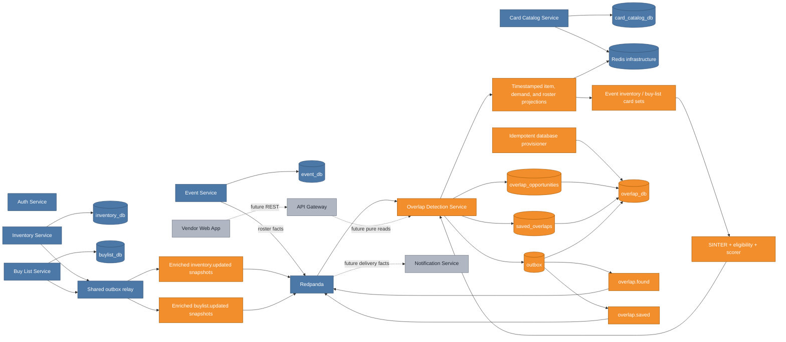
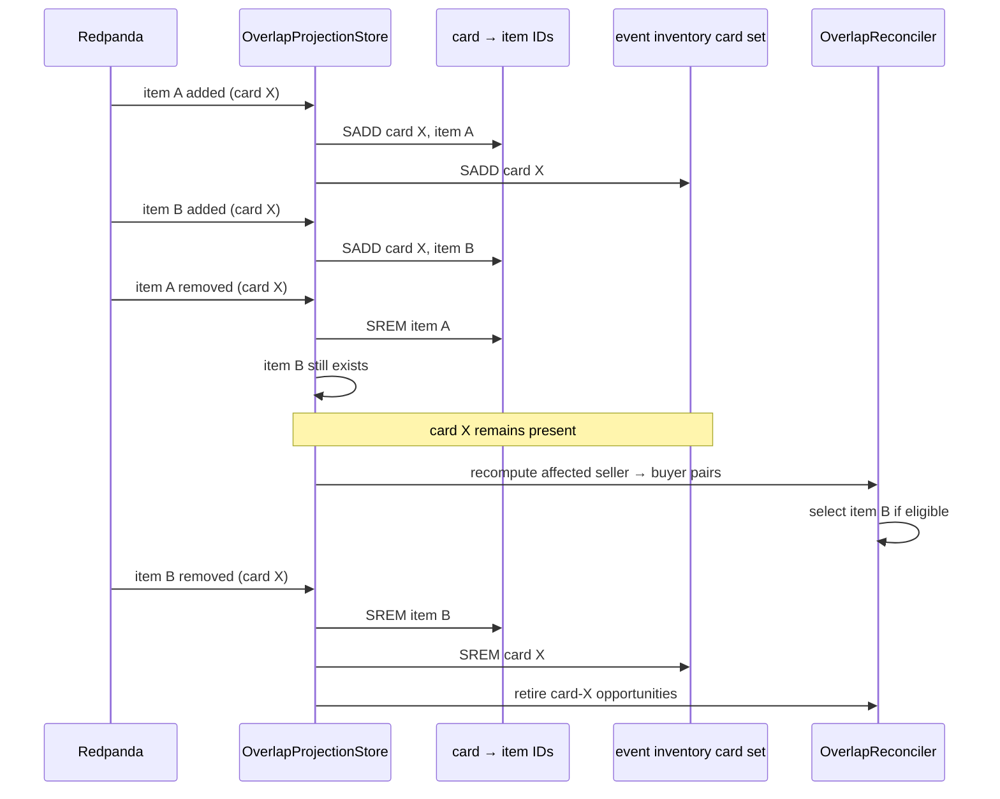
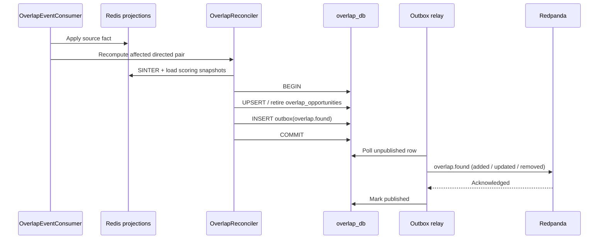

# Phase 3 Overlap Engine: turning independent supply and demand into event-scoped opportunities

Phase 2 deliberately kept Event, Inventory, and Buy List independent. That gave each service a clean source of truth, but it did not yet answer VenDex's central question: “Which vendor at this event has something another vendor wants?” The Overlap Detection Service is the first component that combines those facts into an actionable product result.

The engine is event-driven. Kafka facts update replayable Redis projections, Redis `SINTER` finds candidate cards, Java applies price/condition/quantity eligibility and scoring, and PostgreSQL stores the stable opportunity read model. The gRPC API only reads precomputed results; opening a page never triggers matching work.

## Cumulative system view

**Legend:** blue is already on `main`; orange is added or materially changed by this increment; gray is planned but not built yet.



The orange contract nodes are important. Inventory and Buy List were already blue services, but their original facts carried only IDs and an action. That was not enough to score an overlap or safely remove one of several inventory rows for the same card. This increment changes those output contracts while keeping the producer services' ownership unchanged.

## Major entities introduced or modified

| Entity | Kind | Responsibility |
|---|---|---|
| `InventoryUpdated` | Kafka contract | Carries stable item ID plus event scope, condition, quantity, price, and priority snapshot. |
| `BuyListUpdated` | Kafka contract | Carries stable wanted-row ID plus minimum condition, max price, and desired quantity. |
| `OverlapFound` | Kafka contract | Carries deterministic opportunity identity, selected rows, score inputs, score, and add/update/remove action. |
| `OverlapSaved` | Kafka contract | Announces a newly saved event-plan item for downstream conversation and day-of notification state. |
| `OverlapProjectionStore` | Redis projection | Applies timestamp ordering, retains tombstones, indexes item copies, and materializes event card sets. |
| `OverlapEventConsumer` | Kafka consumer | Maps each source fact to only the directed vendor pairs that can have changed. |
| `OverlapScorer` | Domain policy | Rejects price/condition mismatches, then computes a deterministic 0–100 ranking. |
| `OverlapReconciler` | Transactional materializer | Diffs desired versus active opportunities and atomically writes PostgreSQL plus outbox facts. |
| `overlap_opportunities` | PostgreSQL table | Retains stable live and retired opportunity snapshots. |
| `saved_overlaps` | PostgreSQL table | Stores idempotent per-vendor event-plan actions, including inactive historical opportunities. |
| `overlap.proto` | gRPC API | Defines pure overlap reads plus save/list event-plan operations. |
| `postgres-provision` | Compose lifecycle job | Idempotently creates service databases so old Postgres volumes gain `overlap_db` without being deleted. |
| `OverlapApplicationIT` | Integration test | Proves the complete Redpanda → Redis → scoring → PostgreSQL/outbox → gRPC/Kafka flow. |

## Why the source events needed snapshots

The original `inventory.updated` shape was roughly `{vendor, event, card, action}`. It could tell a consumer that a card changed, but not:

- which of several inventory rows changed;
- whether the remaining rows still kept that card available;
- the asking price, condition, quantity, or liquidation priority needed for scoring;
- the previous value needed to publish a meaningful removal without calling Inventory synchronously.

The same gap existed on demand: `{vendor, card, action}` did not carry the buyer's condition, price, or quantity constraints.

The enriched facts are self-contained projections of the producer's committed row. A removal carries the final snapshot too. This keeps the overlap path Kafka-driven and replayable; Inventory and Buy List never become synchronous dependencies of the matching consumer.

This is a pre-production contract correction. An established deployment would normally version the topic or use a schema registry compatibility policy. VenDex has no retained production event history yet, so changing the shared records and starting the new `overlap-projection-v1` consumer group is the clearer migration.

## Redis model: item truth first, card sets second

The spec's fast-path sets still exist:

```text
vendex:overlap:event:{event}:vendor:{vendor}:inventory
vendex:overlap:event:{event}:vendor:{vendor}:buylist
vendex:overlap:event:{event}:vendors
```

Those are materialized card-level views used by `SINTER`. They are not sufficient as source truth because a vendor can own two rows for the same card. The projection therefore also stores:

- one timestamped hash per inventory item **and scope**;
- one timestamped hash per wanted row;
- one timestamped roster hash per event/vendor;
- source card→active-item-ID sets;
- vendor→active-event and event→active-vendor sets.

The item scope is part of the Redis identity. Moving an item from one event to another produces an old-scope removal and a new-scope addition at the same timestamp; the two facts update different projection hashes and cannot suppress each other.

### Removing one of several copies



Without the item-ID layer, the first removal would incorrectly remove card X from the seller's event inventory even though item B remained.

## Replay, duplicates, and crash recovery

Every entity hash records `occurred_at`, action, active state, and the snapshot fields. The comparison rules are:

- newer facts apply;
- older facts are ignored;
- identical facts are duplicates;
- removal wins an equal-timestamp tie;
- inactive hashes remain as tombstones.

Duplicate facts intentionally reapply idempotent set membership. Suppose the process writes a snapshot hash and crashes before updating the card index. Kafka does not commit the offset, so it redelivers. The hash comparison recognizes a duplicate, but the store still repairs the index before returning. A stale older fact does neither.

The Redis update and PostgreSQL reconciliation are not one distributed transaction. If Redis succeeds and PostgreSQL fails, redelivery sees a duplicate projection and recomputes anyway. PostgreSQL reconciliation compares the desired snapshot to its current row, so a retry after a successful database commit creates no duplicate outbox fact.

## Affected-pair recomputation

The consumer avoids an all-event recalculation:

- inventory change for vendor S recomputes only `S → each buyer` at the affected event(s);
- buy-list change for vendor B recomputes only `each seller → B` at B's active events;
- registration recomputes both directions between the joining vendor and every existing vendor;
- vendor unregistration retires every opportunity involving that vendor at the event.

Global inventory and the persistent buy list may arrive before roster membership. Their source projections are retained. Registration materializes them into the new event sets, so cross-topic arrival order does not change the result.

## Intersection, eligibility, and scoring

For a directed seller S and buyer B at event E:

1. `SINTER(E/S/inventory, E/B/buylist)` returns candidate card IDs.
2. The engine loads every active global or event-scoped inventory row for that card and the active demand row.
3. Price and condition eligibility are applied.
4. Each eligible row is scored; the highest-scoring row becomes the materialized opportunity.

| Factor | Points | Rule |
|---|---:|---|
| Price alignment | 35 | `asking / max`; terms closer to the buyer's ceiling rank higher. Free-for-free gets 35. |
| Condition | 20–25 | 20 for meeting the exact minimum, up to 5 for higher quality. |
| Quantity | 0–25 | Fulfilled fraction `min(available, wanted) / wanted`. |
| Liquidation | 0 or 15 | 15 when the seller marked the row `liquidate`. |

The threshold is configurable and defaults to zero, so eligibility controls inclusion while score controls ranking. This avoids silently hiding a valid low-priced opportunity merely because “closer to max” receives more price-alignment points.

## Stable identity and reconciliation

An opportunity ID is deterministic from:

```text
(event_id, buyer_vendor_id, seller_vendor_id, card_id)
```

It does not include the selected inventory item. If the best copy disappears and a second copy remains, the opportunity is updated under the same ID. That stability is what makes notifications, saved plans, unread state, and conversation history safe to upsert.



Inactive opportunities remain in PostgreSQL. This preserves their deterministic identity and allows a saved event-plan item to show that an opportunity is no longer live rather than disappearing without explanation.

## Saving an event-plan item

`SaveOverlap` verifies that the opportunity exists, is active, and includes the supplied vendor as buyer or seller. The unique `(vendor_id, overlap_id)` constraint makes repeated saves idempotent. Only the first insert publishes `overlap.saved` in the same database transaction.

The Overlap service owns this truth because it owns both the opportunity and the save/list API. The future Notification service will consume `overlap.saved` to create interest/conversation state and its own delivery schedule. That avoids either service reading the other's database.

## Verification strategy

Fast tests cover source-topic dispatch, affected-pair direction, stale suppression, bidirectional registration, vendor retirement, candidate selection, no-op reconciliation, add/remove publication, scoring, pagination, ownership, inactive saves, and idempotent `overlap.saved` publication.

Redis integration tests prove global materialization, event isolation, duplicate-row retention, last-copy removal, duplicate repair, out-of-order rejection, and equal-timestamp removal precedence. PostgreSQL tests prove stable reactivation, buyer/seller reads, idempotent saves, inactive saved history, and two-direction vendor retirement.

The application integration test uses real PostgreSQL, Redis, and Redpanda. It publishes supply and demand before registration, observes the best scored overlap through gRPC, saves it twice while consuming exactly one `overlap.saved` fact, removes the best copy and observes an update to the fallback copy under the same ID, removes the last copy and observes retirement, consumes all three `overlap.found` actions, reactivates the opportunity, unregisters the buyer, and proves the saved historical plan remains. Compose validation also runs the idempotent provisioner against an initialized database volume.

## What remains after this increment

The core value calculation now exists, but delivery is still gray. The next Phase 3 increment adds Notification Service projections for live overlaps, saved-plan activations, preferences, per-event mutes, digest policy, unread state, and conversation interests. Phase 4 then exposes these pure reads and actions through the API Gateway and the existing `ui/vendex.pen` vendor mockups.
