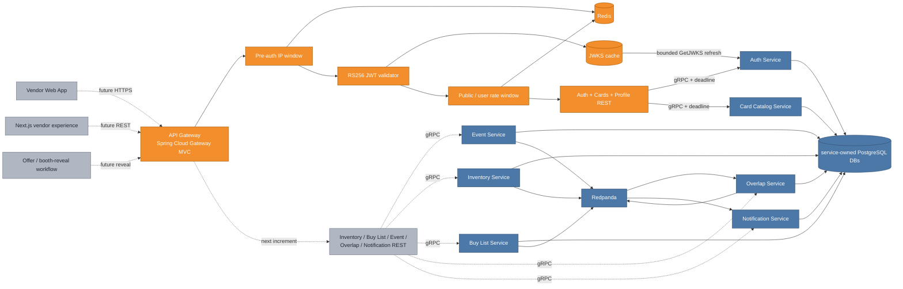

# Phase 4 API Gateway Foundation: establishing the HTTP trust boundary

The backend services intentionally trust caller IDs in their gRPC requests. That was acceptable while no external client could reach them, but a browser must never be allowed to choose `vendor_id` or `user_id` and impersonate another account. This increment adds VenDex's public HTTP boundary: the gateway validates Auth-issued JWTs, derives ownership from verified claims, meters requests in Redis, translates the first REST routes to gRPC, and returns one stable error shape.

This is a foundation increment rather than the whole Phase 4 route surface. Vendor auth, card lookup, and self-profile routes are usable now. Inventory, buy-list, event, overlap, and notification controllers build on the same boundary next; the web application remains future until those workflow routes exist.

## Cumulative system view

**Legend:** blue is already on `main`; orange is added or materially changed by this increment; gray is planned but not built yet.



Redis is blue as an existing platform component and orange in the new request path: the datastore already served catalog/overlap projections, while this increment adds gateway-owned rate-limit keys.

## The request pipeline

```mermaid
sequenceDiagram
    participant B as Browser
    participant C as Correlation filter
    participant E as Edge limiter
    participant J as JWT validator
    participant R as Identity limiter
    participant H as REST handler
    participant S as gRPC service

    B->>C: HTTP request
    C->>C: accept safe X-Request-ID or create UUID
    C->>E: request + response security headers
    E->>E: atomic Redis IP sliding window
    alt protected route
        E->>J: Authorization: Bearer token
        J->>J: parse header; require RS256 and bounded size
        J->>J: resolve kid; verify signature, issuer, time, role, UUID subject
        J->>R: attach verified principal
        R->>R: atomic per-user sliding window
    else register, login, or refresh
        E->>R: no JWT required
        R->>R: atomic public-IP sliding window
    end
    R->>H: validated request
    H->>S: protobuf request with deadline
    S-->>H: protobuf response or gRPC status
    H-->>B: JSON DTO or normalized ApiError
```

The edge window deliberately runs before token parsing. Otherwise a client could send a stream of random `kid` values and make every request call Auth for a JWKS refresh before any rate limiter saw it. A second window still distinguishes low-volume credential endpoints from higher-volume authenticated reads.

The gateway uses the servlet-based Spring Cloud Gateway MVC line because the existing gRPC Java clients are blocking. This avoids hiding blocking calls inside a reactive Netty event loop while retaining the Gateway module and its future routing/filter vocabulary.

## JWT and JWKS behavior

Auth signs access tokens with RS256 and publishes RSA modulus/exponent data over `GetJWKS`. The gateway performs local verification rather than calling `ValidateToken` on every request:

1. Require a JWT header no larger than 4 KiB, algorithm `RS256`, optional type `JWT`, and a non-empty `kid`.
2. Resolve the RSA public key from an in-memory snapshot. A missing `kid` or expired refresh interval causes one synchronized, deadline-bounded Auth call.
3. Verify the signature, exact configured issuer, expiration, issue time, optional not-before time, UUID subject, and known role.
4. Store a typed `GatewayPrincipal` on the request. Controllers obtain their owner ID only from that principal.

The raw token is also retained as a request-scoped, non-logged value so calls to Auth's protected profile methods can forward it as gRPC `authorization` metadata. Auth independently validates that metadata and enforces subject ownership on updates. The gateway's local check protects every public route; Auth's second check preserves its own trust boundary for direct service callers.

The normal JWKS cache is five minutes. If Auth is temporarily unavailable, a previously known key can remain usable for a configurable one-hour stale interval. That trades a bounded revocation delay during an outage for continued access by already signed users. An unknown key is never accepted from stale state. The pre-auth window prevents arbitrary unknown-key refresh pressure.

## Ownership and exposure rules

Public registration always creates a vendor regardless of any client-provided role. Protected foundation routes require a verified vendor role. `GET/PATCH /api/v1/profile` never accepts a user ID; it forwards the JWT subject to Auth. Card reads contain catalog data only.

The gateway maps protobufs into explicit REST DTOs instead of serializing generated protobuf classes. This controls field names and prevents accidental exposure when a service contract later gains an internal field. A self-profile response may include the caller's email; future counterparty decoration will use a separate public vendor summary that omits it unless an authorized reveal workflow succeeds.

## Rate limiting and failure stance

The Redis limiter is an atomic Lua-backed sliding window using a sorted set per identity. Each request removes expired timestamps, checks the current count, inserts a unique member, and refreshes key expiry in one server-side operation. The gateway returns limit/remaining headers on the public or per-user window and `Retry-After` when rejected.

The first deployment keys clients by the servlet connection address and intentionally ignores spoofable forwarding headers. A production reverse proxy must be explicitly trusted/configured before forwarded client IPs are used. If Redis is unavailable, metered routes return `503 RATE_LIMIT_UNAVAILABLE`; they do not silently become unlimited.

## Error and observability contract

Every response receives an `X-Request-ID`, clickjacking/content-sniffing/referrer protections, and a request log containing method, path, status, duration, and MDC request ID. Query strings are not logged, avoiding accidental credential or filter-value leakage.

Filter and controller failures use the same JSON shape:

```json
{
  "timestamp": "2026-08-18T03:00:00Z",
  "status": 404,
  "code": "DOWNSTREAM_NOT_FOUND",
  "message": "card not found",
  "requestId": "gateway-it-request",
  "path": "/api/v1/cards/missing"
}
```

Known gRPC statuses map to HTTP semantics: invalid argument to 400, unauthenticated to 401, permission denied to 403, not found to 404, conflict-style statuses to 409, exhausted to 429, unavailable to 503, and deadline exceeded to 504. Unknown downstream failures become 502; unexpected gateway failures expose no implementation detail.

## Major entities introduced or modified

| Entity | Kind | Responsibility |
|---|---|---|
| `gateway` | Maven/Spring Boot module | Owns the public REST boundary and Spring Cloud Gateway runtime. |
| `GatewayProperties` | configuration contract | Validates gRPC targets/deadline, JWT cache rules, rate limits, and CORS origins. |
| `AuthJwksProvider` | security adapter | Converts Auth protobuf JWKs to RSA keys and provides synchronized fresh/stale caching. |
| `GatewayJwtValidator` | security policy | Validates RS256 signature and all required identity claims locally. |
| `JwtAuthenticationFilter` | HTTP filter | Rejects missing/invalid tokens and attaches the verified principal. |
| `RedisSlidingWindowRateLimiter` | infrastructure adapter | Executes the atomic Redis request-window script. |
| `EdgeRateLimitFilter` / `RateLimitFilter` | HTTP filters | Protect token validation first, then enforce public-IP or per-user policy. |
| `AuthController` | REST-to-gRPC adapter | Vendor register/login/refresh plus caller-owned profile read/update. |
| `CardController` | REST-to-gRPC adapter | Protected card search/detail and set listing. |
| Auth `ErrorMapper` | gRPC boundary | Preserves deliberate unauthenticated/permission-denied statuses instead of masking them as internal failures. |
| `GrpcExceptionHandler` / `GatewayErrorController` / `ApiError` | boundary contract | Normalize validation, domain, transport, framework-routing, and unexpected failures. |
| `GatewayApplicationIT` | integration test | Proves HTTP, filters, JWT/JWKS, Redis, gRPC mapping, caching, and error translation together. |

## Verification strategy

Unit tests generate real RSA key pairs and prove valid claims as well as rejection of expired tokens, wrong issuers, unknown roles, and forged signatures. The application integration test starts the real gateway HTTP server, a real Redis Testcontainer, and networked fake Auth/Card gRPC servers. It registers and logs in a vendor, rejects an unauthenticated card request, verifies and caches JWKS for protected requests, reads cards and the caller's profile, maps both a downstream gRPC not-found error and an unknown HTTP route to the REST envelope, and proves the Redis sliding window denies its third request at a limit of two.

The fake Auth server refuses profile calls without bearer metadata, which proves the gateway forwards the already verified token across that protected hop. A real Compose smoke then runs Gateway against the actual Auth, Card Catalog, PostgreSQL, and Redis containers: vendor registration returns 201, the same card route returns 401 without a token and 200 with one, request ID/rate headers survive the boundary, and the registered shop profile returns 200. Startup and post-request logs contain no error or exception lines.

The Docker image builds the same executable jar under Java 21. Compose publishes the gateway at `localhost:8081`, connects to Auth/Card Catalog over the internal gRPC network, and reuses the existing Redis service.

## What remains after this increment

The next gateway increment adds authenticated inventory, CSV import, buy-list, event registration/roster, overlap/save, and notification/preferences routes. It will also centralize public counterparty decoration and event-registration authorization. After those routes are verified and merged, the Next.js vendor experience will be built from the canonical `ui/vendex.pen` mockups and `ui/tokens.css`. TLS termination/trusted proxy configuration, production CORS origins, and the Offer-owned booth/contact reveal remain deployment or later workflow concerns rather than implicit trust in this foundation.
