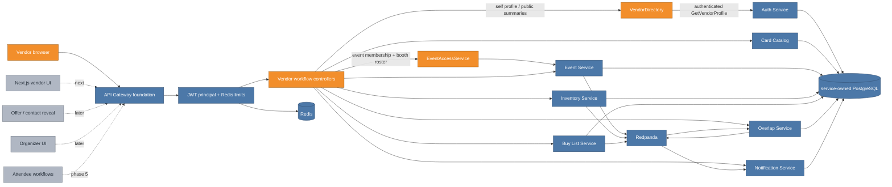

# Phase 4 API Gateway Workflows: turning the trust boundary into a product API

The gateway foundation established who a caller is, how requests are metered, and how failures cross the HTTP/gRPC boundary. This increment uses that identity to make the existing services usable as one vendor product. The important work is not only adding controllers: the gateway must derive every ownership field, enforce event membership before exposing event-scoped data, join service-owned context without leaking email, and preserve VenDex's asymmetric "browse demand, query supply" rule.

## Cumulative system view

**Legend:** blue is already on `main`; orange is added or materially connected by this increment; gray is explicitly future.



The service boxes remain blue because their domain behavior was already complete. The orange change is the synchronous product-facing composition across them: five new REST controllers, five new gateway gRPC channels, membership authorization, and public response decoration.

## The authorization and decoration path

```mermaid
sequenceDiagram
    participant B as Browser
    participant G as Gateway filters
    participant C as Workflow controller
    participant E as Event Service
    participant D as Domain service
    participant A as Auth Service

    B->>G: HTTP + Bearer JWT
    G->>G: meter, verify signature/claims, attach principal
    G->>C: trusted user UUID + VENDOR role
    C->>E: GetEventVendors(event_id)
    E-->>C: active vendor registrations + booths
    alt caller not in roster
        C-->>B: 403 EVENT_REGISTRATION_REQUIRED
    else caller registered
        C->>D: request with owner ID derived from JWT
        D-->>C: rows containing service-owned vendor IDs
        loop each distinct vendor ID
            C->>A: authenticated GetVendorProfile(vendor_id) + own deadline
            A-->>C: profile protobuf including internal email field
        end
        C->>C: map shop/location only; join booth from roster
        C-->>B: explicit public REST DTO
    end
```

There are two different identity questions:

1. **Who owns this mutation or private list?** Always the JWT subject. Inventory, buy-list, event registration, overlap save, seller-interest, notification, and preference requests never accept an owner ID from the public REST contract.
2. **May this caller see event-scoped market data?** The caller must be a vendor and appear in the Event Service's current vendor roster before the gateway calls Inventory, Buy List, or Overlap.

The integration test deliberately sends another user's `vendorId` as an unknown JSON property. The REST DTO discards it, and the networked fake services prove that the gRPC request still contains the JWT subject.

## Route surface

| Area | Routes | Boundary behavior |
|---|---|---|
| Inventory | `GET/POST /inventory`, `PUT/DELETE /inventory/:id` | Lists (optionally filtered by event) and mutates only the JWT vendor's items. Updates are full replacements because the service contract is not patch-shaped. |
| CSV import | `POST /inventory/import` | Carries bounded CSV text, event scope, and dry-run/commit intent; owner comes from JWT. |
| Event supply | `GET /inventory/event/:event_id/search?cardId=…` | Requires event registration and a specific card; never exposes list-all inventory. Adds public vendor + booth context. |
| Buy list | `GET/POST /buylist`, `PUT/DELETE /buylist/:id` | Lists and mutates only the JWT vendor's persistent demand. |
| Event demand | `GET /buylist/event/:event_id` | Requires event registration but remains browseable with optional filters. Adds public vendor + booth context. |
| Events | `GET /events`, `GET /events/:id`, `POST/DELETE /events/:id/register` | Vendors can browse and manage only their own registration. Registration role is forced to vendor. |
| Vendor roster | `GET /events/:id/vendors` | Requires the caller to be on that roster; returns public summaries, booths, and registration times without email. |
| Overlaps | `GET /overlaps/event/:event_id`, `GET .../saved`, `POST /overlaps/:id/save` | Event reads require membership; all overlap operations derive the acting vendor. Counterparties receive public summaries, not contact data. |
| Interests | `GET /overlaps/:id/interests` | Sends the JWT subject as `seller_vendor_id`; Notification Service independently proves overlap seller ownership. |
| Notifications | feed, unread count, mark-read, preferences read/update | All vendor/user IDs come from JWT. Missing preference fields retain current values; a supplied muted-event list replaces the old set. |

All controller-to-service calls use the gateway's configured deadline. Cross-vendor profile decoration de-duplicates vendor IDs and creates a new deadline for every lookup. A deadline-bearing gRPC stub is immutable and its deadline counts down from creation; reusing one stub through a loop would accidentally give later profiles only the time left from the first call.

## Privacy and service ownership

Auth's `GetVendorProfile` is callable by any authenticated user and its protobuf currently contains email alongside public shop fields. That protobuf is not a safe browser response. `VendorDirectory.PublicVendor` is a deliberately narrower anti-corruption DTO:

```text
userId, shopName, city, state, role, booth
```

Email is omitted. Booth is joined from Event Service only when a roster was explicitly loaded for an authorized event page. Overlap and notification decoration pass no roster, so those summaries do not silently cross the later booth/contact-reveal boundary. Card, inventory, buy-list, overlap, notification, and registration records are likewise mapped into explicit REST records rather than serializing generated protobuf classes.

This composition currently performs one Auth RPC per distinct vendor on a page because Auth has no batch public-profile endpoint. De-duplication and per-call deadlines keep the behavior correct at current page sizes. If real roster sizes make it material, the right follow-up is a batch contract or bounded gateway cache—not removing deadlines or leaking the Auth protobuf.

## Browse demand, query supply

VenDex wants attendees and vendors to discover who is looking for a card without turning the convention into an online inventory catalog:

- Buy-list demand can be browsed across a registered event and filtered optionally.
- Inventory supply requires a specific canonical `cardId`; there is no event inventory list route.
- Both reads first confirm the caller is registered for that event.
- The gateway decorates results after the domain query, so Inventory and Buy List remain independently owned services and do not synchronously depend on Auth/Event.

The integration suite proves the access check happens before the domain query by recording the fake Inventory call count, requesting supply for an event whose roster excludes the caller, and asserting the response is `403` while the count does not change.

## Organizer route decision

An older Phase 4 shorthand listed `POST /api/v1/events`, but `product-spec.md` explicitly defers organizer-facing event creation/editing UI. Exposing that shorthand in a vendor-only gateway would either force a vendor ID into `organizer_id` or create a privileged route with no operator-auth policy. This increment therefore exposes vendor event browse/registration only. The existing Event Service creation/update gRPC surface remains available to an operator/admin path until organizer identity and UX are designed.

## Major entities introduced or modified

| Entity | Kind | Responsibility |
|---|---|---|
| `InventoryController` | REST adapter | Self-owned CRUD, CSV import, and registered-event card-specific supply search. |
| `BuyListController` | REST adapter | Self-owned CRUD and registered-event browseable demand. |
| `EventController` | REST adapter | Event browse/detail, self registration, unregistration, and protected vendor roster. |
| `OverlapController` | REST adapter | Event overlaps, saved plans, save action, and seller-owned interest views. |
| `NotificationController` | REST adapter | Feed, mark-read, unread count, and partial preference updates. |
| `EventAccessService` | authorization adapter | Loads Event's vendor roster and rejects non-members before scoped domain calls. |
| `VendorDirectory` | composition adapter | De-duplicates Auth lookups and maps email-bearing profiles into public summaries. |
| `GrpcRequestSupport` | transport utility | Creates deadline-bounded and bearer-forwarding blocking stubs consistently. |
| `PageResponse` | REST contract | Gives all paged workflow routes one offset/has-more envelope. |
| `GatewayProperties.Services` / `GrpcClientsConfig` | configuration | Adds Event, Inventory, Buy List, Overlap, and Notification channels. |
| `GatewayWorkflowIT` | integration test | Proves route translation, identity derivation, membership checks, privacy mapping, and decoration over real HTTP/Redis/gRPC boundaries. |

## Verification strategy

`GatewayWorkflowIT` starts the real gateway HTTP server, a real Redis Testcontainer, and one networked gRPC server implementing Auth plus all five workflow services. It signs a real RS256 vendor JWT and verifies:

- event browse, self-registration, and protected vendor roster;
- profile bearer forwarding and absence of Auth's email field in public JSON;
- inventory add/update/delete, CSV dry-run, and decorated event search;
- buy-list add/update/delete and decorated event demand;
- overlap list/save and seller interest decoration;
- notification feed and partial preference update;
- malicious owner IDs never override the JWT subject; and
- an unregistered event request returns 403 without reaching Inventory.

The existing gateway integration test continues to cover public auth, JWKS caching, core filters, error normalization, card/profile reads, and the atomic Redis sliding window. Real Compose verification connects this gateway image to the actual seven backend services, PostgreSQL, Redis, and Redpanda rather than only test doubles. The real smoke registered two vendors, joined both to an operator-seeded event, wrote seller inventory and buyer demand, observed the Kafka-derived overlap, saved it, observed the seller's interest and buyer notification, and updated preferences. Ownership IDs matched the two JWT subjects, event supply returned the seller shop/booth, the roster exposed zero email fields, and recent logs contained no error or exception lines.

## What remains

The vendor REST API needed by Phase 4 is complete after this increment. The next slice builds the Next.js vendor experience from the canonical `ui/vendex.pen` mockups and `ui/tokens.css`, then exercises the routes as user workflows rather than isolated requests. Production TLS/trusted-proxy configuration, a batch profile contract if scale requires it, organizer UX, Offer-owned contact reveal, and attendee behavior remain explicit later work.
