# Phase 4 card batch hydration: turning domain IDs into useful screens

Inventory, buy-list, overlap, and notification records correctly store canonical `card_id` references instead of copying catalog data. That keeps each service's data small and prevents names, sets, or images from becoming stale. It also leaves the product-facing client responsible for turning those IDs into displayable cards.

Card Catalog has supported `GetCardsByIds` since Phase 1, including cache-aware lookup and request-order preservation. The Phase 4 gateway exposed search and single-card reads but omitted that batch RPC. A frontend rendering 25 inventory rows would therefore need up to 25 REST calls after loading the rows. This increment connects the existing internal batch capability to one authenticated, bounded REST route.

## Cumulative system view

**Legend:** blue is already on `main`; orange is added or materially connected by this increment; gray is explicitly future.

```mermaid
flowchart LR
    Browser[Vendor browser]
    Frontend[Next.js vendor screens]
    Bff[Same-origin frontend BFF]
    Gateway[API Gateway]
    Principal[Verified vendor principal]
    ExistingCards[Card search + detail routes]
    BatchRoute[POST /cards/batch\n1–100 IDs]
    BatchRpc[GetCardsByIds RPC]
    Catalog[Card Catalog Service]
    Redis[(Card cache)]
    Postgres[(card_catalog_db)]
    DomainRows[Inventory / Buy List /\nOverlap / Notification APIs]

    Browser -. next .-> Frontend
    Frontend -. next .-> Bff
    Bff -. next .-> Gateway
    Gateway --> Principal
    Principal --> ExistingCards
    Principal --> BatchRoute
    BatchRoute --> BatchRpc
    BatchRpc --> Catalog
    Catalog --> Redis
    Catalog --> Postgres
    Gateway --> DomainRows

    classDef current fill:#4C78A8,stroke:#2F4B6C,color:#fff;
    classDef added fill:#F28E2B,stroke:#9A5200,color:#fff;
    classDef future fill:#B0B7C3,stroke:#68717D,color:#1F2933;
    class Gateway,Principal,ExistingCards,BatchRpc,Catalog,Redis,Postgres,DomainRows current;
    class BatchRoute added;
    class Browser,Frontend,Bff future;
```



The internal batch RPC, Card Catalog cache, and PostgreSQL store remain blue because they already exist on `main`. Orange is the missing public adapter and its newly connected flow. The Next.js consumer is gray in this PR because it will land in the following frontend increment.

## Product data flow

```mermaid
sequenceDiagram
    participant F as Future vendor screen
    participant G as Gateway
    participant C as Card Catalog
    participant R as Redis / PostgreSQL

    F->>G: GET /inventory
    G-->>F: rows containing cardId
    F->>G: POST /cards/batch { cardIds: distinct IDs }
    G->>G: validate JWT vendor + 1–100 bounded IDs
    G->>C: GetCardsByIds(card_ids)
    C->>R: cache many; query only misses
    R-->>C: canonical card records
    C-->>G: cards in requested order; unknowns absent
    G-->>F: explicit CardResponse list
    F->>F: join card metadata to domain rows by ID
```

The domain APIs remain independently owned and do not synchronously depend on Card Catalog. The client composes two coarse-grained reads: business rows first, then one de-duplicated metadata hydration call. This avoids both service coupling and the browser's REST N+1 pattern.

## Boundary behavior

- The route requires the same verified `VENDOR` role as card search and detail.
- Requests contain between 1 and 100 IDs; each ID is non-blank and at most 100 characters.
- IDs may be canonical UUIDs or legacy external catalog IDs because the existing Card Catalog contract supports both.
- Card Catalog preserves request order and de-duplicates repeated IDs.
- Unknown IDs are absent from the response rather than failing the complete batch. Clients join by returned ID and can render a fallback for missing catalog data.
- The gateway returns explicit `CardResponse` DTOs, not generated protobuf messages.

## Major entities introduced or modified

| Entity | Kind | Change | Responsibility |
|---|---|---|---|
| `CardController.batch` | REST adapter | Added | Authenticates the vendor, validates a bounded ID list, and calls the existing batch RPC with a gateway deadline. |
| `CardBatchBody` | Request contract | Added | Enforces 1–100 non-blank card IDs with bounded length. |
| `CardBatchResponse` | Response contract | Added | Wraps explicit public card DTOs under a stable `cards` field. |
| `GatewayApplicationIT` | Integration test | Modified | Proves the route over real HTTP/JWT/Redis and networked fake gRPC, plus the 100-ID limit. |
| `technical-spec.md` | Architecture specification | Modified | Records the batch route, contract limit, and N+1 avoidance. |

## What remains

The frontend will de-duplicate IDs across each loaded page, call this endpoint once, and keep a page-local card map for rendering. Cross-request browser caching can be added later if real usage justifies it; Card Catalog's Redis cache already prevents repeated database work. No copied card metadata is added to Inventory, Buy List, Overlap, or Notification storage.
