# Phase 4 event registration read model: loading one vendor's event state

The vendor frontend needs to answer a simple question on its dashboard and event list: "Which events am I registered for?" Before this increment, Event Service could list an event's complete vendor or attendee roster, but it could not list one user's registrations. A browser would have needed to fetch every event and then probe every roster—an N+1 request pattern that grows with the catalog and exposes more roster data than the page needs.

This increment adds one paginated, role-scoped query to Event Service and exposes a vendor-only, caller-owned REST read through the gateway. It does not add a new database or duplicate event state.

## Cumulative system view

**Legend:** blue is already on `main`; orange is added or materially connected by this increment; gray is explicitly future.

```mermaid
flowchart LR
    Browser[Vendor browser]
    Frontend[Next.js dashboard + event hub]
    Gateway[API Gateway]
    RegistrationRoute[GET /events/registrations]
    Principal[Verified vendor principal]
    EventGrpc[Event gRPC service]
    UserQuery[ListEventRegistrationsForUser]
    Repository[EventRepository user + role query]
    EventDb[(event_registrations)]
    OtherServices[Auth / Inventory / Buy List /\nOverlap / Notification]
    Attendee[Attendee registration UI]
    Organizer[Organizer UI]

    Browser -. next .-> Frontend
    Frontend -. next .-> Gateway
    Gateway --> Principal
    Principal --> RegistrationRoute
    RegistrationRoute --> EventGrpc
    EventGrpc --> UserQuery
    UserQuery --> Repository
    Repository --> EventDb
    Gateway --> OtherServices

    Attendee -. phase 5 .-> Gateway
    Organizer -. later .-> Gateway

    classDef current fill:#4C78A8,stroke:#2F4B6C,color:#fff;
    classDef added fill:#F28E2B,stroke:#9A5200,color:#fff;
    classDef future fill:#B0B7C3,stroke:#68717D,color:#1F2933;
    class Gateway,Principal,EventGrpc,EventDb,OtherServices current;
    class RegistrationRoute,UserQuery,Repository added;
    class Browser,Frontend,Attendee,Organizer future;
```



The existing Event Service and its `event_registrations` table remain blue. Orange is the new read path across the public REST adapter, protobuf contract, domain service, and repository. The frontend is gray in this PR because it is the next consumer and is not yet on `main`.

## Request and trust flow

```mermaid
sequenceDiagram
    participant F as Future vendor frontend
    participant G as Gateway
    participant E as Event Service
    participant D as event_db

    F->>G: GET /api/v1/events/registrations?pageSize=25&pageOffset=0
    G->>G: validate JWT; require VENDOR role
    G->>E: ListEventRegistrationsForUser(JWT subject, VENDOR, page)
    E->>D: WHERE user_id = ? AND role = ?\nORDER BY registered_at DESC LIMIT page+1
    D-->>E: registrations
    E-->>G: items + next offset + hasMore
    G-->>F: explicit RegistrationResponse page
```

The browser cannot supply the owner or role. `EventController` takes both from the verified gateway principal, so changing query parameters cannot reveal another user's registrations or attendee state. Event Service still accepts both values because it is an internal boundary also used by later trusted callers.

## Why the query lives in Event Service

Registration is roster state owned by Event Service. Computing it in the gateway would require one `GetEventVendors` call per event, while copying it into a frontend or gateway store would create a second source of truth. The direct query keeps ownership intact and makes the cost proportional to the page size.

Pagination uses the repository's established one-extra-row pattern: request `pageSize + 1`, return at most `pageSize`, and set `hasMore` plus the next offset only when the extra row exists. Results are deterministic by `registered_at DESC, id ASC`.

## Major entities introduced or modified

| Entity | Kind | Change | Responsibility |
|---|---|---|---|
| `ListEventRegistrationsForUserRequest/Response` | Protobuf contract | Added | Carries trusted user/role scope and offset pagination across the internal boundary. |
| `EventRepository.listRegistrationsForUser` | Repository query | Added | Reads one user's role-specific registrations in deterministic reverse chronology. |
| `EventService.RegistrationPage` | Domain read model | Added | Validates and bounds pagination, applies the one-extra-row rule. |
| `EventGrpcService.listEventRegistrationsForUser` | gRPC adapter | Added | Maps the protobuf request to the domain service and returns the paged contract. |
| `EventController.registrations` | REST adapter | Added | Derives vendor identity and role from JWT and returns the stable gateway page envelope. |
| `EventServiceTest` | Unit test | Modified | Proves role scoping, bounded pagination, next offset, and `hasMore`. |
| `EventApplicationIT` | Integration test | Modified | Proves the generated gRPC contract against real PostgreSQL. |
| `GatewayWorkflowIT` | Integration test | Modified | Proves the authenticated HTTP route sends only the JWT-owned vendor scope. |

## Verification and next use

The focused verification compiles the changed protobuf and runs Event Service unit/integration tests plus Gateway unit/integration tests. The Event integration test inserts a real registration and reads it back over a real gRPC server and PostgreSQL container. The Gateway workflow test calls the real HTTP server with a signed JWT and checks the fake Event server received that JWT subject and the forced vendor role.

The next frontend increment will combine this lightweight registration page with event summaries for dashboard and event-hub state. Attendee registration reads, organizer tooling, and any richer event aggregation remain later work rather than widening this vendor endpoint.
