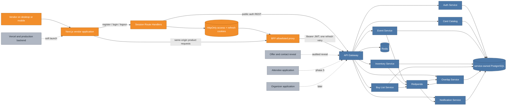
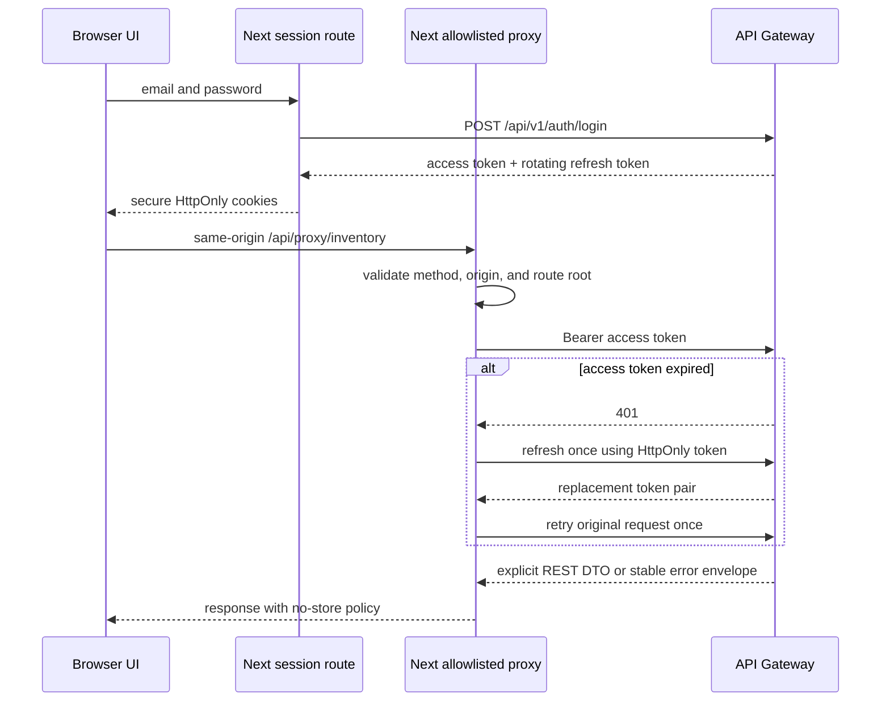

# Phase 4 Vendor Frontend: turning service contracts into an event workspace

The backend could already authenticate vendors, validate event membership, manage
inventory and demand, calculate overlaps, and deliver notifications. This increment
makes those capabilities usable as one responsive product while preserving the API
gateway as the browser-facing backend trust boundary.

## Cumulative system view

**Legend:** blue is already on `main`; orange is added or materially connected by
this increment; gray is explicitly future.

The orange layer does not move authorization into the browser. It gives the browser
a same-origin application boundary that owns cookie transport and translates UI
actions into the existing gateway REST surface. The blue services remain the source
of truth for identity, ownership, event membership, and domain state.

## Session and request flow

Tokens never enter `localStorage` or client component state. The proxy exposes only
the product route roots required by the vendor UI and rejects path segments outside a
strict character set. Unsafe browser requests are checked for same-origin context,
and logout deletes both cookies. Page redirects are convenience routing only; the API
gateway still verifies every JWT and derives ownership from its subject.

## Product workflows

| Area | UI behavior | Backend composition |
|---|---|---|
| Onboarding | Marketing page, signup, login, first-action guidance | Next session handlers call public gateway auth and create an HttpOnly session |
| Dashboard | Active event, readiness, counts, best overlaps, recent activity | Profile, event registrations, inventory, buy list, overlap, saved-plan, notification, and batch-card reads |
| Inventory | Manual CRUD plus file → resolution → preview → commit | Gateway inventory routes; Papa Parse rewrites only explicitly selected fuzzy candidates before a second dry run |
| Buy list | Search canonical cards and maintain price/condition demand | Self-owned gateway buy-list routes |
| Events | Browse, register/unregister, and inspect authorized vendor roster | Caller-owned registration read plus membership-protected roster |
| Opportunities | Buy/sell direction, pricing, conditions, score, saved event plan | Event-scoped overlap and saved-plan reads; batched card hydration |
| Notifications | Activity feed, unread badge, mark-read, preferences | Notification feed/count/read/preference routes |
| Settings | Profile and notification preference editing | Self-owned profile and partial preference updates |

Existing rows contain canonical card IDs rather than display data. `hydrateCards`
de-duplicates those IDs and calls `POST /cards/batch` in chunks of 100, avoiding one
browser request per inventory, buy-list, overlap, or notification row.

## CSV correction model

The importer deliberately keeps the backend as the matching authority:

1. The original CSV is submitted as a dry run.
2. The backend returns exact matches and ambiguous rows with catalog candidates.
3. A vendor may explicitly choose one candidate per ambiguous row.
4. The frontend reparses the original CSV, replaces only `card_name` and `set_name`
   in those rows, preserves every other column and quoted value, and submits another
   dry run.
5. The reviewed CSV is committed only after the second preview. Inventory Service
   retains its atomic write behavior for resolved rows; unresolved rows stay visible
   in the report and are skipped.

This avoids inventing a second fuzzy matcher in JavaScript and makes the final commit
repeat the same validation that generated the preview.

## Major entities introduced or modified

| Entity | Kind | Responsibility |
|---|---|---|
| `frontend` | Next.js application | Hosts the responsive vendor product and server-side BFF boundary |
| `AppShell` | client layout | Desktop/mobile navigation, profile identity, unread count, and logout |
| Session Route Handlers | server adapters | Validate auth forms, call public gateway routes, and manage secure cookies |
| BFF proxy Route Handler | server adapter | Allowlist protected gateway paths, add bearer auth, refresh once, and relay bounded responses |
| `useResource` | client hook | Load and retry screen-level compositions without duplicating state machinery |
| `CardSearch` / `hydrateCards` | client data utilities | Select canonical cards and batch-hydrate existing canonical IDs |
| `CsvImport` / `applyCandidateCorrections` | workflow UI + utility | Resolve ambiguous CSV rows and preserve reviewed source data |
| Vendor pages | App Router routes | Compose dashboard, inventory, buy list, event, overlap, notification, and settings workflows |
| Frontend CI job | GitHub Actions quality gate | Reproduce installs, lint, test, and run a production Next build on every PR |
| `ui/tokens.css` | shared design source | Supplies the implemented palette without duplicating hex literals in the app |

## Verification

Vitest and Testing Library cover the marketing workflow explanation, BFF route and
origin policy, 100-item card batch boundaries and de-duplication, and CSV candidate
correction with quoted commas and extra columns. ESLint and strict TypeScript checks
are clean. The production Next build generates all public, session, proxy, and vendor
routes. GitHub Actions now runs the same locked install, lint, test, and build
independently of the Maven backend job.

## Deliberate follow-ups

- The visible `Reveal Booth & Contact` action stays disabled. Returning private booth
  or contact data belongs to the future Offer-owned audited reveal flow; the frontend
  does not weaken that boundary to make the button work early.
- No attendee or organizer routes are present.
- Vercel/backend deployment and real-vendor soft-launch validation are operational
  increments, not simulated in this frontend change.
- `ui/vendex.pen` remains the canonical mockup. This implementation follows its
  existing desktop/mobile direction and adds no new mockup concept requiring a pen
  mutation.
