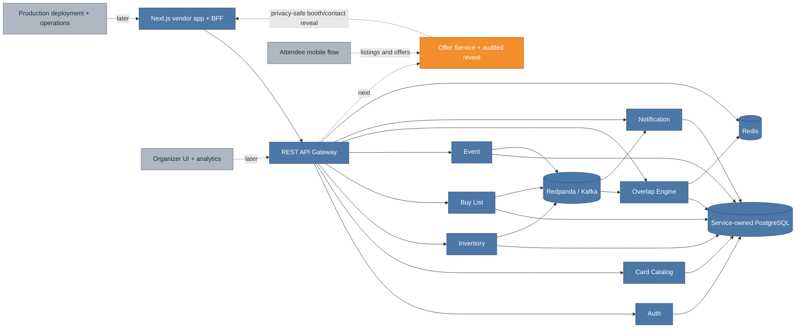

# VenDex project handoff — 2026-08-18

This is the restart point for the next implementation session. It separates what is
implemented from what is merely specified so “Phase 4 is built” is not mistaken for
“the product has been validated in production.”

## Executive status

- **Repository state:** `main` includes PRs #8–#22. There are no open pull requests.
- **Current product boundary:** the vendor-side MVP is implemented end to end: Auth,
  catalog, inventory, buy lists, events, overlap matching, notifications, REST gateway,
  and responsive web application.
- **Validation state:** all local and hosted engineering gates pass, but the Phase 4
  soft launch with real vendors has not happened.
- **Open GitHub issues:** #4 (reconcile/harden the Auth interceptor contract) and #6
  (cache parsed RSA public keys while defining revocation behavior).
- **How far are we?** Close to a locally usable vendor pilot; not close to the entire
  product specification. Phase 5 attendee listings/offers is a new bounded context and
  mobile flow, and Phase 6 organizer/production work is still later.

The best next move is to finish the two small Auth issues, exercise the complete vendor
journey with seeded data, then implement the Offer privacy boundary needed for booth
reveal. Do not start attendee functionality until the vendor pilot clears the validation
bars in `technical-spec.md` unless product scope is consciously changed.

## What VenDex is trying to solve

VenDex is event-centric coordination software for Pokémon TCG vendors. At a convention,
vendors have limited time and capital but currently discover complementary inventory and
demand through booth walks, spreadsheets, Discord, and Instagram messages. VenDex lets
vendors publish what they are bringing and what they want, detects supply/demand overlap
among vendors attending the same event, and turns that overlap into an event plan.

It is deliberately a **meeting layer, not a marketplace or transaction system**:

- no checkout, escrow, reservation, or locked price;
- demand is browseable, while supply is query-only for a specific card;
- opportunities remain private and event-scoped;
- the desired outcome is an efficient in-person booth conversation, not more app dwell
  time during the convention.

The repository is also a distributed-systems learning project. Each meaningful increment
has an explainer under `docs/learning/`, so implementation can move quickly without losing
the architectural reasoning.

## Current system and next boundary

**Legend:** blue is implemented on `main`; orange is the next product boundary; gray is
later scope.



The frontend intentionally shows booth/contact reveal as unavailable. Do not bypass this
by exposing private profile or registration data directly. The Offer Service must own the
authorization, explicit reveal, and audit record.

## Completed implementation

### Foundations and backend domains — PRs #8–#15

- Java 21/Spring Boot multi-module foundation, protobuf/gRPC contracts, Flyway, and
  service-owned PostgreSQL databases.
- Auth registration/login/refresh, profiles, RS256/JWKS, encrypted private signing keys,
  and server-managed refresh sessions.
- Canonical card catalog and search.
- Redpanda-compatible shared event contracts and transactional outbox delivery.
- Inventory CRUD and reviewed CSV import with fuzzy resolution.
- Persistent buy lists and event-scoped demand browse.
- Event lifecycle, vendor/attendee registration model, and durable roster events.
- Redis-backed event-scoped overlap materialization, saved plans, conversation interests,
  and notification projections/preferences.

### Vendor product boundary — PRs #16–#20

- **#16:** REST-to-gRPC gateway trust boundary, JWT/JWKS validation, rate limiting,
  deadlines, error normalization, and caller-derived ownership.
- **#17:** inventory, CSV, buy-list, event, overlap, saved-plan, notification, and profile
  workflows exposed through the gateway with event membership checks and privacy-safe DTOs.
- **#18:** indexed caller-owned event-registration read model for dashboard/event state.
- **#19:** ordered card batch hydration through an authenticated gateway endpoint, capped
  at 100 IDs.
- **#20:** responsive Next.js vendor app following `ui/vendex.pen` and `ui/tokens.css`:
  signup/login, dashboard, inventory and four-step CSV flow, buy list, events and roster,
  opportunities/saved plans, notifications, settings, and secure HttpOnly-cookie BFF.

### Reliability follow-through — PRs #21–#22

- **#21:** scheduled transactional TCGdex catalog refresh with a PostgreSQL lease,
  bounded HTTP timeouts, observability state, safe pagination, and replica coordination.
- **#22:** atomic signing-key bootstrap/rotation with an advisory transaction lock,
  `SELECT ... FOR UPDATE`, expected-`kid` concurrency semantics, rollback safety, and JWKS
  continuity. Issue #5 closed.

Every source branch was intentionally preserved. Each PR description records its major
entities, verification, follow-ups, and linked system explainer.

## Remaining work, in recommended order

### 1. Reconcile the small Auth backlog

1. **Issue #4 — Auth interceptor contract.** The old issue text references the removed Go
   implementation. Java already has a global `AuthInterceptor`, `AuthContext`, and protected
   handlers that call `requireSubject()`. Audit whether the intended per-method allowlist is
   still desirable. Either harden it with explicit public/protected method policy and tests,
   or update/close the stale issue with evidence. Do not blindly port the old acceptance
   criteria.
2. **Issue #6 — parsed public-key cache.** `JwtService.validate` currently reaches
   `SigningKeyRepository.findById` and reparses PEM for every token validation. Add a bounded
   `kid -> RSAPublicKey` cache, but first make revocation semantics explicit: the current
   repository lookup does not exclude `revoked_at`. Test cache hits, unknown kids, rotation,
   and revocation/invalidation. The issue text also references old Go paths and needs updating.

### 2. Prove the vendor journey, not just individual screens

- Seed a representative event, several vendors, cards, inventory, and buy-list demand.
- Run signup/login → profile → event registration → CSV import → overlap → saved event plan
  through the browser against the full Compose stack.
- Add an end-to-end smoke suite for that golden path if the manual pass exposes no contract
  gaps. Current frontend tests are component regressions, not a full browser journey.
- Resolve UX/contract defects found during this pass while continuing to follow
  `ui/vendex.pen`; the mockups are the visual source of truth.

### 3. Complete the vendor pilot boundary

- Design and implement the Offer Service's audited vendor-to-vendor booth/contact reveal.
- Add the gateway route and enable the currently disabled frontend action only after its
  privacy contract is tested.
- Decide whether authenticated email delivery is required for the pilot; current preference
  state exists, but email transport is deferred.
- Deploy a pilot environment, add baseline observability/backups/secrets, and recruit the
  Phase 4 cohort.
- Validate the explicit bars: at least five active vendors, one convention's inventory,
  one real overlap-driven booth meeting, and qualitative workflow feedback.

### 4. Phase 5 only after vendor validation

- Offer-owned anonymous attendee listings, temporary lifecycle, vendor interest/preliminary
  offers, acceptance, identity reveal, and expiry.
- Attendee-scoped gateway authorization and “browse demand, query supply” APIs.
- Mobile attendee signup, event home, browse/search, listing, offers, and acceptance screens.
- Privacy tests must prove no attendee identity or cross-attendee listing access leaks.

### 5. Later operations and product scope

- Organizer event-management and aggregate analytics UI.
- Production deployment/hosting, monitoring, restore drills, runbooks, and cost controls.
- Demand intelligence and proximity features only after core event coordination is validated.

## Verification baseline at handoff

The following all passed immediately before this document was written:

- full Maven reactor: all 11 modules;
- Auth-focused suite: 27 unit tests and 8 integration tests;
- frontend lint, 7 Vitest tests, and production build;
- Docker Compose configuration validation;
- Auth container image build;
- PR #22 hosted backend CI (5m09s) and frontend CI (37s).

Run the baseline with:

```bash
mvn --batch-mode --no-transfer-progress verify
cd frontend
npm run lint
npm test -- --run
npm run build
```

Integration tests use Testcontainers, so Docker must be available.

## Where the next agent should start

1. Start from current `origin/main`; do not reuse or rewrite a preserved historical branch.
2. Read `README.md`, this handoff, `product-spec.md`, and the relevant section of
   `technical-spec.md` before changing scope.
3. Inspect GitHub issues #4 and #6 against the Java implementation; both descriptions are
   historically useful but path-level details are stale.
4. Take one bounded increment per PR, with focused tests before the full regression suite.
5. After Auth cleanup, prioritize the end-to-end seeded vendor journey and Offer boundary.

Useful paths:

| Path | Purpose |
|---|---|
| `product-spec.md` | Product thesis, users, privacy rules, phased scope |
| `technical-spec.md` | Implemented contracts, schemas, and roadmap |
| `docs/learning/` | Increment-by-increment architecture explainers |
| `ui/vendex.pen` | Frontend source mockups |
| `ui/tokens.css` | Shared visual tokens consumed by the app |
| `frontend/` | Next.js application and BFF |
| `gateway/` | Authenticated REST boundary and gRPC orchestration |
| `services/` | Independently owned backend domains |
| `proto/` | Cross-service gRPC contracts |
| `events/` | Shared event envelopes/outbox support |

## PR documentation convention

Continue the convention in `.github/PULL_REQUEST_TEMPLATE.md`:

- explain what changed and why;
- list major entities added or modified;
- record exact verification;
- identify deliberate follow-ups;
- link an explainer under `docs/learning/` when the system design changes;
- use blue `#4C78A8` for the existing system, orange `#F28E2B` for the increment,
  and gray `#B0B7C3` for future components.

Merge completed PRs without deleting their branches. Do not manually close a PR just to
make the list clean; address it or leave its status truthful.
